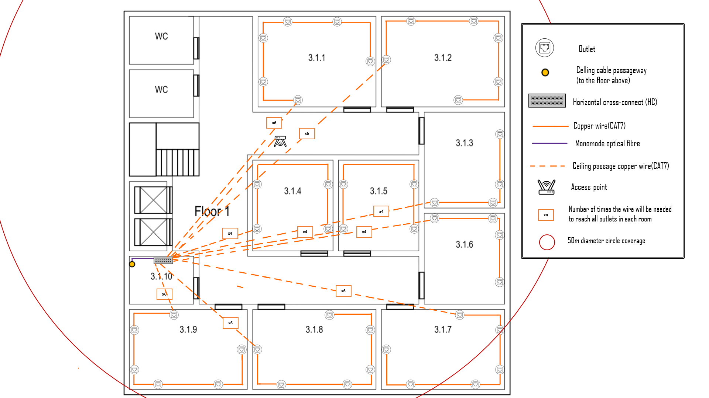

RCOMP 2021-2022 Project - Sprint 1 - Member 1200720 Folder
===========================================

## Identification of the structured cabling standards used

- Minimum of 2 outlets per work area.
- Proportion of 2 outlets for every 10 square meters of area.
- Patch cords can reach up to 5 meters.
- There must always be an outlet less than 3 meters from the user's equipment.
- Work areas require copper cable outlets.
- Each cable (whatever type) length should be less than 90 meters.
- The total area covered by a horizontal cross-connect should be less than 1000 m2.
- Straight line distance between the horizontal cross-connect and the outlet should be less than 80 meters.
- Cables connecting an intermediate cross-connect (IC) to a horizontal cross-connect (HC) are limited to 500 meters in length.
- Cables connecting the main cross-connect (MC) to an IC are limited to 1500 meters in length.
- The number of cables entering a telecommunications cabinet must always be less than 200.

## Building 3

### Scale measure:

- 2,8 cm (scale) = 5m (reality)

### Building measurement:

- As the building has the shape of a square, it was only necessary to measure one of its sides and convert this measurement to the real scale.

| Build | Length (m) | Width(m) | Area(m2) | 
|-------|------------|----------|----------|
| 3     | 19,64      | 19,64    | 385,84   |

## Building 3 - Floor 0 

### Calculated information:
| Room    | Length (m) | Width (m) | Area (m2) | Number of outlets |
|---------|------------|-----------|-----------|-------------------|
| 3.0.1   | 5,18       | 3,04      | 15,72     | 4                 |
| 3.0.2   | 5,18       | 3,04      | 15,72     | 4                 |
| 3.0.3   | 5,18       | 3,04      | 15,72     | 4                 |
| 3.0.4   | 5,18       | 3,57      | 18,49     | 4                 |
| 3.0.5   | 8,39       | 3,21      | 26,98     | 6                 |
| 3.0.6   | 8,39       | 3,21      | 26,98     | 6                 |
| 3.0.7   | 8,39       | 3,21      | 26,98     | 6                 |
| 3.0.8   | 4,11       | 3,21      | 13,20     | 4                 |
| 3.O.9   | 3,21       | 2,50      | 8,04      | -                 |

### Outlet positioning:

* As rooms 3.0.5, 3.0.6 and 3.0.7 have a length of 8.39 meters, we had to be careful to comply with the structured cabling standard, which tells us that a user must always have an outlet available. less than 3 meters. To achieve this objective, the reasoning methodology used was to divide the length of the wall into three equal parts, thus ensuring that there will always be an outlet less than three meters away.

* For the other rooms, the same reasoning was implemented: distributing the outlets along the midpoints of the walls, so that we could achieve a balanced distribution.

### Cable path layout:

* **As we will assign numbers to the outlets to better organize the measurement process, we will consider that outlet number 1 will always receive the cable from the HC and the others will be numbered incrementally, always clockwise.**

#### Measurement of cables needed for the room 3.0.1:
| Outlet | Amount of cable needed to get from the HC to the outlet (m) |
|--------|-------------------------------------------------------------|
| 1      | 44,08                                                       |
| 2      | 46,64                                                       |
| 3      | 49,76                                                       |
| 4      | 47,08                                                       |

* Total = 187,57m

#### Measurement of cables needed for the room 3.0.2:
| Outlet | Amount of cable needed to get from the HC to the outlet (m) |
|--------|-------------------------------------------------------------|
| 1      | 40,82                                                       |
| 2      | 43,42                                                       |
| 3      | 46,46                                                       |
| 4      | 43,86                                                       |

* Total = 174,58m

#### Measurement of cables needed for the room 3.0.3:
| Outlet | Amount of cable needed to get from the HC to the outlet (m) |
|--------|-------------------------------------------------------------|
| 1      | 39,93                                                       |
| 2      | 42,53                                                       |
| 3      | 43,07                                                       |
| 4      | 40,48                                                       |

* Total = 166,02m

#### Measurement of cables needed for the room 3.0.4:
| Outlet | Amount of cable needed to get from the HC to the outlet (m) |
|--------|-------------------------------------------------------------|
| 1      | 35,48                                                       |
| 2      | 38,07                                                       |
| 3      | 39,85                                                       |
| 4      | 37,26                                                       |

* Total = 150,67

#### Measurement of cables needed for the room 3.0.5:
| Outlet | Amount of cable needed to get from the HC to the outlet (m) |
|--------|-------------------------------------------------------------|
| 1      | 25,43                                                       |
| 2      | 28,64                                                       |
| 3      | 30,61                                                       |
| 4      | 32,57                                                       |
| 5      | 28,47                                                       |
| 6      | 26,50                                                       |

* Total = 172,22m

#### Measurement of cables needed for the room 3.0.6:
| Outlet | Amount of cable needed to get from the HC to the outlet (m) |
|--------|-------------------------------------------------------------|
| 1      | 22,04                                                       |
| 2      | 25,25                                                       |
| 3      | 27,22                                                       |
| 4      | 29,18                                                       |
| 5      | 24,89                                                       |
| 6      | 22,93                                                       |

* Total = 151,51m

#### Measurement of cables needed for the room 3.0.7:
| Outlet | Amount of cable needed to get from the HC to the outlet (m) |
|--------|-------------------------------------------------------------|
| 1      | 25,43                                                       |
| 2      | 28,64                                                       |
| 3      | 30,62                                                       |
| 4      | 32,57                                                       |
| 5      | 28,29                                                       |
| 6      | 26,32                                                       |

* Total = 171,87m

#### Measurement of cables needed for the room 3.0.8:
| Outlet | Amount of cable needed to get from the HC to the outlet (m) |
|--------|-------------------------------------------------------------|
| 1      | 6,86                                                        |
| 2      | 12,22                                                       |
| 3      | 10,43                                                       |
| 4      | 8,64                                                        |

* Total = 38,16m

#### Measurement of cables needed to reach the access-point:
| Outlet | Amount of cable needed to get from the HC to the outlet (m) |
|--------|-------------------------------------------------------------|
| 1      | 13,54                                                       |

* It is worth mentioning that a socket for the access point will be needed, this socket was not represented in the image because it would become confusing and unreadable. Importantly, we consider that the access point will be attached to the ceiling.

##### Fiber Optic Cable

- The amount of fiber optic cable needed from the entrance of the building to room 3.0.9 where the IC is located is 34,19m.

- The amount of fiber optic cable needed from the IC in room 3.0.9 to the HC in the same room will be 0,05m.

- The amount of fiber optic cable needed from the IC in room 3.0.9 to the gutter that will take the fiber to floor 1 is 7,46m.

### Relevant Justifications:

#### Outlets

- Common areas such as the entrance hall, bathrooms, and stairs do not require outlets.

- The distribution of outlets was carried out taking into account the best locations so that the room in question would not be too affected, so that they are not close to doors and so that it is possible to use the middle of the room to work more easily.

- The positioning of the outlets was also designed so that the maximum distance between them is three meters, so that in any part of the room where the user's equipment is located, with the patch cord provided, access to a socket of the network.

- The number of outlets per room was obtained using the proportion of 2 outlets for every 10 square meters of area.
- As room 3.0.9 is a storage area, it was not necessary to place outlets in this room.

#### Access Points

- Only one access point was placed on this floor, given the dimensions of the building.

- Access Points are connected to an outlet using a CAT7 copper cable.

- The Access point will be located in the entrance hall of the building, between rooms 3.0.9 and 3.0.6, and will be located on the ceiling.

- The channel for the AP of this floor will be 1.

#### Horizontal cross-connect

- This floor has only one HC, as it has a coverage of about 1000 square meters and the building has only 385.84 square meters of area.

- As room 3.0.9 is a warehouse it will be used to store the Horizontal cross-connect. This was stored in the same telecommunications closet as the Intermediate cross-connect.

#### Intermediate cross-connect

- As room 3.0.9 is a warehouse, it will be used to store the Intermediate cross-connect. This one was stored in the same telecommunications closet as the HC.

- The IC receives optical fiber from the MC located in building 1 and passes the optical fiber to the two HCs in this building.

#### Telecommunications Offices

The super scaling strategy applied was as follows:

- Determine the size of telecommunications cabinets by multiplying the amount of space required for the housed patch panels by four and rounding up to the next commercially available size.

##### Room 3.0.9

- Since 39 outlets are associated with the HC, there will be 39 connections, so 2 copper patch panels with 24 inputs will be needed, totaling a size of 2U.

- Since the HC connects to the IC, it will need a Fiber Patch Panel, which is 1U in size.

- The space saved for active equipment will have a size of 3U.

- In addition to the value already calculated, an extra size of 6U will be added.

- That said, the total size for this telecommunications cabinet will be 12U.

#### Floor 0 technical information:
- The ceiling height of floor 0 it's 4 meters.
- The telecommunications enclosures that will house the HC and the IC are located 1.5m from the floor.

#### Examples for a better understanding of scale conversion and area calculation:

- Example of how the size of the rooms in the image was converted to their actual size.
  

- After having done the process of converting the size of the rooms in the image to their real size, it was necessary to calculate the area of each room. As the rooms are rectangular, it was only necessary to multiply their length by the width after converting the units. Below we will show an example of how the calculations were made.
  
  

### Inventory floor 0:

| Equipment                             | Quantity |
|---------------------------------------|----------|
| Monomode optical fibre                | 41,70m   |
| Copper cable (CAT7)                   | 1226,14m |
| Outlets                               | 39       |
| Copper patch cords (5m)               | 38       |
| Fibre patch cords (0,5m)              | 24       |
| Copper patch cords (0,5m)             | 49       |
| Acess-point                           | 1        |
| 9U size telecommunications enclosures | 1        |
| Copper patch panel with 24 inputs     | 2        |
| Fiber Patch Panel with 24 inputs      | 1        |

## Building 3 - 1st Floor

###  Calculated information:
| Room   | Length (m) | Width (m)	 | Area (m2)  | Number of outlets |
|--------|------------|------------|------------|-------------------|
| 3.1.1  | 6,25       | 4,46       | 27,90      | 6                 |
| 3.1.2  | 6,25       | 4,46       | 27,90      | 6                 |
| 3.1.3  | 4,82       | 4,11       | 19,80      | 4                 |
| 3.1.4  | 4,64       | 4,11       | 19,07      | 4                 |
| 3.1.5  | 4,64       | 4,11       | 19,07      | 4                 |
| 3.1.6  | 4,64       | 4,11       | 19,07      | 4                 |
| 3.1.7  | 6,25       | 4,46       | 25,67      | 6                 |
| 3.1.8  | 6,25       | 4,46       | 25,67      | 6                 |
| 3.1.9  | 6,25       | 4,46       | 25,67      | 6                 |
| 3.1.10 | 3,21       | 2,50       | 8,04       | -                 |

### Outlet positioning:

* As rooms 3.1.7, 3.1.8 and 3.1.9 have a length of 6.25 meters, we had to be careful to comply with the structured cabling standard, which tells us that a user must always have an outlet available. less than 3 meters. To achieve this objective, the reasoning methodology used was to divide the length of the wall into three equal parts, thus ensuring that there will always be an outlet less than three meters away.

* For the other rooms, the same reasoning was implemented: distributing the outlets along the midpoints of the walls, so that we could achieve a balanced distribution.

### Cable path layout:

* **As we will assign numbers to the outlets to better organize the measurement process, we will consider that outlet number 1 will always receive the cable from the HC and the others will be numbered incrementally, always clockwise.**

#### Measurement of cables needed for the room 3.1.1:
| Outlet | Amount of cable needed to get from the HC to the outlet (m) |
|--------|-------------------------------------------------------------|
| 1      | 13,68                                                       |
| 2      | 16,94                                                       |
| 3      | 19,17                                                       |
| 4      | 21,85                                                       |
| 5      | 24,97                                                       |
| 6      | 28,77                                                       |

* Total = 125,38m

#### Measurement of cables needed for the room 3.1.2:
| Outlet | Amount of cable needed to get from the HC to the outlet (m) |
|--------|-------------------------------------------------------------|
| 1      | 18,14                                                       |
| 2      | 21,94                                                       |
| 3      | 25,06                                                       |
| 4      | 27,74                                                       |
| 5      | 29,97                                                       |
| 6      | 33,41                                                       |

* Total = 156,26m

#### Measurement of cables needed for the room 3.1.3:
| Outlet | Amount of cable needed to get from the Hc to the outlet (m) |
|--------|-------------------------------------------------------------|
| 1      | 17,96                                                       |
| 2      | 24,66                                                       |
| 3      | 22,25                                                       |
| 4      | 20,02                                                       |

* Total = 84,89m 

#### Measurement of cables needed for the room 3.1.4:
| Outlet | Amount of cable needed to get from the Hc to the outlet (m) |
|--------|-------------------------------------------------------------|
| 1      | 8,14                                                        |
| 2      | 10,46                                                       |
| 3      | 16,89                                                       |
| 4      | 19,21                                                       |

* Total = 54,67m

#### Measurement of cables needed for the room 3.1.5:
| Outlet | Amount of cable needed to get from the Hc to the outlet (m) |
|--------|-------------------------------------------------------------|
| 1      | 12,43                                                       |
| 2      | 14,75                                                       |
| 3      | 21,18                                                       |
| 4      | 23,50                                                       |

* Total = 71,86m

#### Measurement of cables needed for the room 3.1.6:
| Outlet | Amount of cable needed to get from the Hc to the outlet (m) |
|--------|-------------------------------------------------------------|
| 1      | 17,96                                                       |
| 2      | 20,02                                                       |
| 3      | 22,21                                                       |
| 4      | 24,53                                                       |

* Total = 84,72m

#### Measurement of cables needed for the room 3.1.7:
| Outlet | Amount of cable needed to get from the HC to the outlet (m) |
|--------|-------------------------------------------------------------|
| 1      | 15,46                                                       |
| 2      | 30,20                                                       |
| 3      | 26,85                                                       |
| 4      | 24,79                                                       |
| 5      | 22,21                                                       |
| 6      | 19,08                                                       |

* Total = 138,59m

#### Measurement of cables needed for the room 3.1.8:
| Outlet | Amount of cable needed to get from the HC to the outlet (m) |
|--------|-------------------------------------------------------------|
| 1      | 9,93                                                        |
| 2      | 24,66                                                       |
| 3      | 21,31                                                       |
| 4      | 19,26                                                       |
| 5      | 16,67                                                       |
| 6      | 13,54                                                       |

* Total = 105,37m

#### Measurement of cables needed for the room 3.1.9:
| Outlet | Amount of cable needed to get from the HC to the outlet (m) |
|--------|-------------------------------------------------------------|
| 1      | 6,18                                                        |
| 2      | 20,73                                                       |
| 3      | 17,12                                                       |
| 4      | 13,99                                                       |
| 5      | 11,40                                                       |
| 6      | 9,35                                                        |

* Total = 78,77m

#### Acess-point 
| Outlet | Amount of cable needed to get from the HC to the outlet (m) |
|--------|-------------------------------------------------------------|
| 1      | 10,82                                                       |

* It is worth mentioning that a socket for the access point will be needed, this socket was not represented in the image because it would become confusing and unreadable. Importantly, we consider that the access point will be attached to the ceiling.

##### Fiber optic cable

- The amount of fiber optic cable needed from the floor cable passageway to the HC will be 3.46m.

 
### Relevant Justifications:

#### Outlets

- Common areas such as the entrance hall, bathrooms, and stairs do not require electrical outlets.

- The distribution of points of sale was carried out taking into account the best locations so that the room in question would not be too affected, so that they are not close to doors and so that it is possible to use the middle of the room to work more easily.

- The positioning of the sockets was also designed so that the maximum distance between them is three meters so that anywhere in the room where the user's equipment is located, with the supplied patch cord, it has access to a network socket.

- The number of outlets per room was obtained by the proportion of 2 outlets for every 10 square meters of area.

- As room 3.1.10 is a storage area, it was not necessary to place sockets in this room.

#### Access Points

- Only one access was placed on this floor, given the dimensions of the building.

- Access points are connected to an outlet using a CAT7 copper cable.

- The access point will be located in the corridor between rooms 3.1.1 and 3.1.4 and will be positioned on the ceiling.

- The channel for this floor's AP will be 6.

#### Horizontal cross-connect

- This floor has only one HC, as it has a coverage of about 1000 square meters and the building has only 385.84 square meters of area.

- As room 3.1.10 is a warehouse, it will be used to store the horizontal Cross-connect.

#### Telecommunications Offices

The super scaling strategy applied was as follows:

- Determine the size of telecommunications cabinets by multiplying the amount of space required for the patch panels housed by four and rounding up to the next commercially available size.

##### Room 3.1.10

- As 47 sockets are associated with the HC, there will be 47 connections, so 3 copper patch panels with 24 inputs will be needed, totaling a size of 3U.

- As the HC connects to the IC, it will need a Fiber Patch Panel, which is 1U in size.

- The space saved for active equipment will be 4U in size.

- In addition to the value already calculated, an extra size of 8U will be added.

- That said, the total size of this telecom cabinet will be 16U.

#### Floor 1 technical information:

- As the first floor has a false ceiling that is 2.5m from the floor, the connections between the outlets and the HC, as well as the connection between the HC and the CP, will all be made through this false ceiling.

- The telecommunication cabinet that will house the HC will be 1.5m from the ground.

### 1st floor inventory:

| Equipment                              | Quantity |
|----------------------------------------|----------|
| Monomode optical fibre                 | 3,46 m   |
| Copper cable (CAT7)                    | 912,33 m |
| Outlets                                | 47       |
| Copper patch cords (5m)                | 46       |
| Fibre patch cords (0,5m)               | 24       |
| Copper patch cords (0,5m)              | 73       |
| Acess-point                            | 1        |
| 12U size telecommunications enclosures | 1        |
| Copper patch panel with 24 inputs      | 3        |
| Fiber Path Panel with 24 inputs        | 1        |

### Total Building Inventory:

| Equipment                              | Quantity  |
|----------------------------------------|-----------|
| Monomode optical fibre                 | 45,16 m   |
| Copper cable (CAT7)                    | 2138,47 m |
| Outlets                                | 86        |
| Copper patch cords (5m)                | 84        |
| Fibre patch cords (0,5m)               | 48        |
| Copper patch cords (0,5m)              | 122       |
| Acess-point                            | 2         |
| 16U size telecommunications enclosures | 1         |
| 12U size telecommunications enclosures | 1         |
| Copper patch panel with 24 inputs      | 5         |
| Fiber Path Panel with 24 inputs        | 2         |