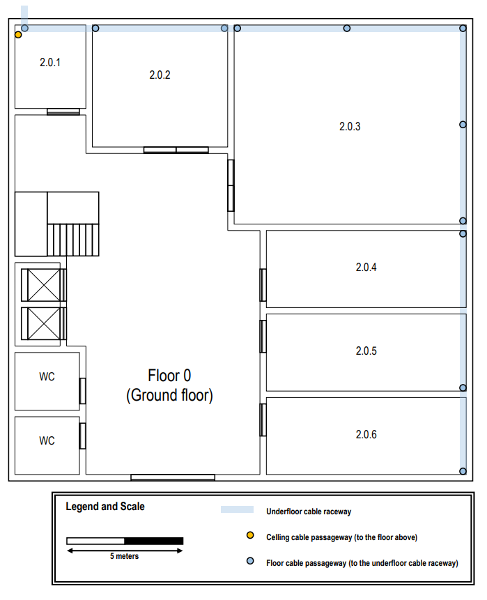

RCOMP 2021-2022 Project - Sprint 1 - Member 1201239 folder
===========================================

## These were the followed structured cabling standards:
- Minimum of 2 outlets per work area.
- Ratio of 2 outlets for every 10 square meters of area, with them being at less than 3 meters from the user's equipment.
- Each cable (whatever type) length should be less than 90 meters.
- The total area covered by a horizontal cross-connect should be less than 1000 m2.
- Straight line distance between the horizontal cross-connect and the outlet should be less than 80 meters.
- Cables connecting an intermediate cross-connect (IC) to a horizontal cross-connect (HC) are limited to 500 meters in length.
- The number of cables entering a telecommunications cabinet must always be less than 200.

### Important Remarks:

- So that the plants dimensions could be measured, the provided scale was used. Its real length of 5m
is equivalent to 2.7cm on an A4 printed sheet.

- Once the measurements were performed, the obtained measures 
were converted using the following formula:

- Each room and both floors are considered geometric rectangles. So, it's possible to obtain an area
by just multiplying a division's length by its width.

- Since no cost cap was presented by the Project Owner, techwise, the most efficient solutions were adopted.\
This means that the vertical connections between Cross-Connects were made with Fiber Optic Cable, while horizontal ones were performed with Copper Cabling (specifically, CAT7A)\
For example, IC and HC are connected through fiber, while CP's and Outlets are Copper Cable Connected.\
Although Fiber Optic Cabling may be cheaper, on this ocasion it might require the use of more Fiber Optic Patch Panels, which can greatly increase the cost of the network design and installation.

## Cabling Redundancy:

> Cabling Redundancy allows for automatic or manual failoever.
>> Failover is a process which consists of switching between cables in order to keep the network running.
>
> But how could failover increase a system fidelity?
>> For example, if Building 1 MCC Fiber Optic Cable which connects to other buildings failed, it would mean that the connections would be lost.\
> So, Structured Cabling Standards indicate that a system should have parallel connections to its elements. If that's a system characteristic, if a connection cable fails, others will resume its functionality.\
> Not only that, but it also allows for load balancing on the network.
>
> On this network, it was opted for each Fiber Optic Connection to have 8 cables instead of 1, which allows for a secure failover.
  
# Building 2 

- This is a subtitle which helps interpretate the performed design for the building:Ç

## Ground Floor:

> The floor itself is square, with a side of **19,07 m (10,3 cm)**, thus having an area of **363,67 m2**.
> 
> The ceiling height is **4m**.

### Individual Rooms' Dimensions:

| Room  | Length (m) | Width (m) | Area (m2) | Number of outlets |
|-------|------------|-----------|-----------|-------------------|
| 2.0.1 | 2,96       | 3,51      | 10,39     | 0 (Storage Unit)  |
| 2.0.2 | 5,74       | 5,37      | 30,82     | 8                 |
| 2.0.3 | 9,91       | 8,52      | 84,43     | 18                |
| 2.0.4 | 8,52       | 3,33      | 28,37     | 6                 |
| 2.0.5 | 8,52       | 3,33      | 28,37     | 6                 |
| 2.0.6 | 8,52       | 3,33      | 28,37     | 6                 |

## Ground Floor with outlets:

### Justifications about the decisions made

*Thanks to the integrated underfloor raceway on the building, it is possible to route the needed cables to the several rooms.\
The mentioned cables include copper and fiber cabling.* 

> **Intermediate Cross-Connect**
>>  The intermediate cross-connect is responsible for receiving the optic fiber cable coming from the Main Cross-Connect located on Building 1.\
> It's located on room 2.0.1 and connected to the Horizontal Cross-Connect on the same floor and the floor above.

> **Horizontal Cross-Connect**
>> This floor contains a single HC, since its total area is inferior to 1000 m2 (based on the given standards).\
>  Being located on the same room as the IC (2.0.1), it allows for the needed cable to be a lesser amount than if mounted on other room.\
> It also allowed to copper connect to all the outlets on rooms 2.0.2 and 2.0.3

> **Consolidation Points**
>> There is only one consolidation point on this floor. It connects to the 2.0.4,5,6 rooms' 18 total outlets.

> **Outlets**
>> Having in consideration a real world outlet layout, the floor outlets were mostly placed on the rooms' walls.\
> Only in one room will the building owner be able to find outlets on the ground (which is on the biggest room).\
> The mapped placement was also defined respecting the rule which states that wherever a user may stand in a room, it should have an outlet located at a maximum of 3m.

### Important Note: The Outlet Order is defined clockwise

### Room 2.0.1

 - This room is responsible for housing the Building's IC and the floor's HC.
 - The Building's **IC** requires a Fiber Patch Panel, since it is fiber connected to both HC's (Ground and First Floor) through 8 Fiber Optic Cables each, which leads to a total of 16 occupied ports.
 - Although the number of unused outlets is big, it allows for future expansibility. This Fiber Patch Panel is 1U sized.
 - The **HC** connects to a total of 26 Outlets, which requires a 2 24 Ports Copper Patch Panel, which totals 2U size. Since the CP is also fiber connected (through 8 fiber optic cables), it is required for the HC to have a 1U sized fiber patch panel.
 - The total required space sits at 4U, however, a 2x increase in terms of capacity to futureproof the enclosure leads to a 16U sized enclosure.
 
### Room 2.0.2

| Outlet | CAT 7 Length (m) |
|--------|------------------|
| 1      | 4,44             |
| 2      | 6,85             |
| 3      | 9,81             |
| 4      | 11,48            |
| 5      | 13,15            |
| 6      | 4,44             |
| 7      | 6,67             |
| 8      | 9,26             |

### Room 2.0.3

| Outlet | CAT 7 Length (m) |
|--------|------------------|
| 1      | 10,74            |
| 2      | 13,89            |
| 3      | 17,04            |
| 4      | 20,56            |
| 5      | 22,96            |
| 6      | 25,37            |
| 7      | 28,51            |
| 8      | 31,67            |
| 9      | 34,63            |
| 10     | 36,67            |
| 11     | 14,26            |
| 12     | 10,93            |
| 13     | 15,74            |
| 14     | 18,89            |
| 15     | 22,22            |
| 16     | 19,26            |
| 17     | 22,22            |
| 18     | 18,89            |

### Room 2.0.4

| Outlet | CAT 7 Length (m) |
|--------|------------------|
| 1      | 12,96            |
| 2      | 10,56            |
| 3      | 8,15             |
| 4      | 11,48            |
| 5      | 13,70            |
| 6      | 16,30            |

### Room 2.0.5

 - This room is responsible for housing the Consolidation Point which makes the Outlets on rooms 2.0.4,5,6 possible.
 - The CP requires a 24 Port Fiber Optic Patch Panel, so that the Redundant connection to the HC can be successfully completed. It has a size of 1U.
 - The CP requires a 24 Port Cat7 Copper Patch Panel, which has a size of 1U.
 - The total required space sits at 2U, however, a 2x increase in terms of capacity to futureproof the enclosure leads to a 4U sized enclosure.

| Outlet | CAT 7 Length (m) |
|--------|------------------|
| 1      | 9,81             |
| 2      | 7,22             |
| 3      | 5,00             |
| 4      | 1,67             |
| 5      | 2,97             |
| 6      | 6,48             |

### Room 2.0.6

| Outlet | CAT 7 Length (m) |
|--------|------------------|
| 1      | 13,33            |
| 2      | 10,93            |
| 3      | 8,52             |
| 4      | 5,37             |
| 5      | 7,78             |
| 6      | 10,37            |

### Fiber Optic Cable

| Type of Planning                      | Fiber Optic (m) |
|---------------------------------------|-----------------|
| On the Actual floor (no redundancy)   | 35,56           |
| On the Actual floor (with redundancy) | 284,48          |

**This leads to a total of 284,48m of fiber optic used to connect the Floor 0 to the Building network**

### Floor inventory:

| Room | Total CAT7A Cable (m) |
|------|-----------------------|
| 2    | 66,10                 |
| 3    | 384,45                |
| 4    | 73,15                 |
| 5    | 33,15                 |
| 6    | 56,30                 |

| Equipment                   | Quantity       |
|-----------------------------|----------------|
| RJ45 Outlet                 | 40             |
| CAT7A Cable                 | 613,15m        |
| Fiber Optic Cable           | 284,48m        |
| 5m Copper Patch Cord        | 40 (200m)      |
| 0,5m Copper Patch Cord      | 72 (36m)       |
| Access Point                | 0              |
| Copper Patch Panel          | 3 (3 * 1U)     |
| Fiber Optic Patch Panel     | 3 (1U, 1U, 1U) |
| Telecommunication Enclosure | 2 (16U, 9U)    |

## Floor Nº1:

> Like the floor beneath, it has a side of **19,07 m (10,3 cm)**, thus having an area of **363,67 m2**.
> 
> This floor is a bit different. It has a drop ceiling, which sits at a height of **2.5m**.

### Individual Rooms' Dimensions:

| Room   | Length (m) | Width (m) | Area (m2) | Number of outlets                           |
|--------|------------|-----------|-----------|---------------------------------------------|
| 2.1.1  | 2,96       | 3,51      | 10,39     | 0 (Storage Unit)                            |
| 2.1.2  | 2,96       | 5,19      | 15,36     | 4                                           |
| 2.1.3  | 2,96       | 5,19      | 15,36     | 4                                           |
| 2.1.4  | 2,78       | 5,19      | 14,43     | 4                                           |
| 2.1.5  | 2,96       | 5,19      | 15,36     | 4                                           |
| 2.1.6  | 3,33       | 5,19      | 17,28     | 4                                           |
| 2.1.7  | 6,30       | 3,33      | 20,98     | 7 (+1 required because of the access point) |
| 2.1.8  | 6,30       | 3,33      | 20,98     | 6                                           |
| 2.1.9  | 2,96       | 5,19      | 15,36     | 4                                           |
| 2.1.10 | 2,96       | 5,19      | 15,36     | 4                                           |
| 2.1.11 | 2,96       | 5,19      | 15,36     | 4                                           |
| 2.1.12 | 3,52       | 5,19      | 18,27     | 4                                           |

## First Floor with outlets:

### Justifications about the decisions made

*Thanks to the integrated underfloor raceway on the building, it is possible to route the needed cables to the several rooms.\
The mentioned cables include copper and fiber cabling.*

> **Horizontal Cross-Connect**
>> Like the floor below, this one contains a single HC, since its total area is inferior to 1000 m2 (based on the given standards).\
> It is connected to the IC on the floor below thanks to a fiber optic cable, which goes through the floor cable passageway
> It is directly responsible for the connection to the outlets on rooms 2.1.2,3,4,5,6

> **Consolidation Points**
>> There is only one consolidation point on this floor. It connects to the 2.1.7,8,9,10,11,12 rooms' and the floor Access Point.

> **Outlets**
>> Having in consideration a real world outlet layout, the floor outlets were mostly placed on the rooms' walls.\
> The mapped placement was also defined respecting the rule which states that wherever a user may stand in a room, it should have an outlet located at a maximum of 3m.
> However, most of the copper cabling which connects to the outlets is guided through the drop ceiling, facilitating the job. 

### Important Note: The Outlet Order is defined clockwise

### Room 2.1.1

- This room is responsible for housing the Building's floor's HC, which is connected  to the building's IC, through 8 fiber optic cables
- Since the only CP on the floor is also fiber connected (8 cables), it is required for the HC to have a 1U sized fiber patch panel, with 16 ports occupied.
- The **HC** connects to a total of 20 Outlets, which requires a 24 Ports Copper Patch Panel, 1U sized.
    - Although a small numer of fiber ports will be used, it allows for costless future upgrades.
- The total required space sits at 2U, however, a 50% increase in terms of capacity to futureproof the enclosure leads to a 4U sized enclosure.

### Room 2.1.2

| Outlet | CAT 7 Length (m) |
|--------|------------------|
| 1      | 8,70             |
| 2      | 11,70            |
| 3      | 13,74            |
| 4      | 10,74            |

### Room 2.1.3

| Outlet | CAT 7 Length (m) |
|--------|------------------|
| 1      | 12,04            |
| 2      | 15,00            |
| 3      | 17,04            |
| 4      | 14,08            |

### Room 2.1.4

| Outlet | CAT 7 Length (m) |
|--------|------------------|
| 1      | 15,37            |
| 2      | 18,34            |
| 3      | 20,38            |
| 4      | 17,41            |

### Room 2.1.5

| Outlet | CAT 7 Length (m) |
|--------|------------------|
| 1      | 18,71            |
| 2      | 21,67            |
| 3      | 23,71            |
| 4      | 20,75            |

### Room 2.1.6

| Outlet | CAT 7 Length (m) |
|--------|------------------|
| 1      | 22,04            |
| 2      | 25,00            |
| 3      | 27,04            |
| 4      | 24,08            |

### Room 2.1.7

- The drop ceiling close to this room is responsible for housing the Consolidation Point which makes the Outlets on rooms 2.1.7,8 possible.
- Besides, it also allows the Unique Access Point installed on the building to operate.
- The CP requires a 24 Port Fiber Optic Patch Panel, so that the Redundant connection to the HC can be successfully completed. It has a size of 1U.
- The CP requires 2 * 24 Port Cat7 Copper Patch Panel, which will have 28 occupied ports. It will have a size of 2U.
- Futureproofing the enclosure makes the total at 2*4U = 8U.

| Outlet | CAT 7 Length (m)  |
|--------|-------------------|
| 1      | 3,61              |
| 2      | 6,39              |
| 3      | 8,24              |
| 4      | 10,09             |
| 5 (AP) | 15,37             |
| 6      | 15,65             |
| 7      | 17,50             |

### Room 2.1.8

| Outlet | CAT 7 Length (m) |
|--------|------------------|
| 1      | 9,72             |
| 2      | 12,50            |
| 3      | 14,35            |
| 4      | 16,20            |
| 5      | 21,76            |
| 6      | 23,61            |

### Room 2.1.9

| Outlet | CAT 7 Length (m) |
|--------|------------------|
| 1      | 10,46            |
| 2      | 12,50            |
| 3      | 12,50            |
| 4      | 10,46            |

### Room 2.1.10

| Outlet | CAT 7 Length (m) |
|--------|------------------|
| 1      | 12,80            |
| 2      | 14,90            |
| 3      | 14,90            |
| 4      | 12,86            |

### Room 2.1.11

| Outlet | CAT 7 Length (m) |
|--------|------------------|
| 1      | 15,26            |
| 2      | 17,30            |
| 3      | 17,30            |
| 4      | 15,26            |

### Room 2.1.12

| Outlet | CAT 7 Length (m) |
|--------|------------------|
| 1      | 17,66            |
| 2      | 19,70            |
| 3      | 19,70            |
| 4      | 17,66            |

### Access Point

> Since the dimensions of the building are reduced, it was opted for a single Access Point Strategy.\
> This means that the only AP placed on the building is located on Floor 1 on the ceiling of room 2.1.7.\
> It is powered thanks to a Power Over Ethernet device and the chosen Wi-Fi Channel was 1 (1,6,11 are the best ones, since they don't overlap themselves in terms of frequency).\
> Considering a 50m diameter (which is equivalent to a 25m radius), the whole building will have Wireless Network Coverage.

### Fiber Optic Cable

| Type of Planning                        | Fiber Optic (m)                          |
|-----------------------------------------|------------------------------------------|
| From the Floor below (no redundancy)    | 4 (due to the height of the floow below) |
| On the Actual floor (no redundancy)     | 13,88                                    |
| From the Floor below (after redundancy) | 32                                       |
| On the Actual floor (after redundancy)  | 111,04                                   |

**This leads to a total of 143,04m of fiber optic used to connect the Floor 1 to the Building network**

### Floor inventory:

| Room | Total CAT7A Cable (m) |
|------|-----------------------|
| 2    | 44,88                 |
| 3    | 58,16                 |
| 4    | 71,50                 |
| 5    | 84,84                 |
| 6    | 98,16                 |
| 7    | 76,85                 |
| 8    | 98,14                 |
| 9    | 45,92                 |
| 10   | 55,52                 |
| 11   | 65,12                 |
| 12   | 74,72                 |

### Floor inventory:

| Equipment                    | Quantity   |
|------------------------------|------------|
| RJ45 Outlet                  | 49         |
| CAT7A Cable                  | 773,81m    |
| Fiber Optic Cable            | 143,04m    |
| 5m Copper Patch Cord         | 49 (245m)  |
| 0,5m Copper Patch Cord       | 72 (36m)   |
| Access Point                 | 1          |
| Copper Patch Panel           | 3 (3 * 1U) |
| Fiber Optic Patch Panel      | 2 (2 * 1U) |
| Telecommunication Enclosure  | 2 (6U, 9U) |

===========================================

## Building Inventory:

- After performing the building planning, this is the total Inventory:

| Equipment                   | Quantity            |
|-----------------------------|---------------------|
| RJ45 Outlet                 | 89                  |
| CAT7A Cable                 | 1386,96m            |
| Fiber Optic Cable           | 427,52m             |
| 5m Copper Patch Cord        | 89 (445m)           |
| 0,5m Copper Patch Cord      | 144 (72m)           |
| Access Point                | 1                   |
| Copper Patch Panel          | 6 (6 * 1U)          |
| Fiber Optic Patch Panel     | 5 (5 * 1U)          |
| Telecommunication Enclosure | 4 (16U, 2 * 9U, 6U) |