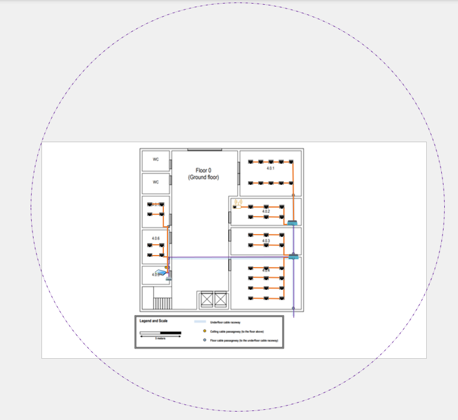

>>RCOMP 2021-2022 Project - Sprint 1 - Member 1201382 folder
>>===========================================
>>(This folder is to be created/edited by the team member 1201382 only)
>>
>>## These were the followed structured cabling standards:
>>
>>- Minimum of 2 outlets per work area.
>>- Proportion of 2 outlets for every 10 square meters of area.
>>- Patch cords can reach up to 5 meters.
>>- There must always be an outlet less than 3 meters from the user's equipment.
>>- Work areas require copper cable outlets.
>>- Each cable (whatever type) length should be less than 90 meters.
>>- The total area covered by a horizontal cross-connect should be less than 1000 m2.
>>- Straight line distance between the horizontal cross-connect and the outlet should be less than 80 meters.
>>- Cables connecting an intermediate cross-connect (IC) to a horizontal cross-connect (HC) are limited to 500 meters in length.
>>- Cables connecting the main cross-connect (MC) to an IC are limited to 1500 meters in length.
>>- The number of cables entering a telecommunications cabinet must always be less than 200.
>>
>>
>>### Scale measure:
>>- 2,8 cm (scale) = 5m (reality)
>>
>> # Building 4
>>
>>### Building Dimensions
>>* Ground floor - 20x20x4m
>>* First floor - 20x20x3m
>>* Building - 20x20x7m
>> ---
>>
>> ## Floor 0 
>>
>>
>>### Legenda:
>>
>>
>>### Observations regarding the design of the Floor 0
>>* The ground floor has an underfloor cable raceway connected to the external technical ditch. Access to the underfloor cable raceway is available at points marked over the plan. The ceiling height on this floor is 4 meters.
>>### Individual Rooms' Dimensions:
>>
>>
>>
>>| Room  | Length (m) | Width (m) | Area (m2) | Number of outlets |
>>|-------|------------|-----------|-----------|-------------------|
>>| 4.0.1 | 7,53       | 5,6       | 42,17     | 10                |
>>| 4.0.2 | 8,67       | 3,29      | 28,52     | 6                 |
>>| 4.0.3 | 8,67       | 3,36      | 29,13     | 6                 |
>>| 4.0.4 | 8,67       | 6,41      | 55,57     | 12                |
>>| 4.0.5 | 3,31       | 2,24      | 7,41      | 0 (Storage Unit)  |
>>| 4.0.6 | 3,31       | 4,17      | 13,80     | 4                 |
>>| 4.0.7 | 3,31       | 3,9       | 12,91     | 4                 |
>>
>>### Outlets Layout
>>* There are no outlets in the common areas or in the WC's as there is no need.
>>* The number of outlets in each division was calculated using the proportion of 2 outlets every 10 meters.
>>* It was also taking into account that whatever point in the room to consider, an outlet is less than 3 meters away.
>>
>>
>>
>>### Cables Layout:
>>Bearing in mind that on this floor, the cables are passed under the ground, the following procedure was carried out:
>>
>>
>>
>>### Access Point
>>* Bearing in mind that an Access Point covers a radius of 25m, with the floor having 20x20x7m, choosing a midpoint and placing there the access point, the entire floor will be covered.
>>* Therefore, the Acess Point is located in the room 4.0.2.
>>* The acess point is connected to an outlet using a CAT7 copper cable.
>>
>>
>>
>>
>>### Consolidation Points 
>>* On this floor, were placed 2 consolidation points - one in the room 4.0.2 and the other in 4.0.4.
>>* The connection to the HC is via the underfloor cable raceway.
>>
>>### Horizontal cross-connect
>>* Bearing in mind that one HC covers about 1000m2 and the floor has 400m2, one HC is enough for the whole floor.
>>
>>### Intermediate cross-connect
>>* The building's datacentre is located in room 4.0.5 so the Intermediate cross-connect was placed in this room located in the same technical cabinet as the Horizontal cross-connect.
>>* The IC receives optical fiber from the MC and passes the optical fiber to the two HC's in this building.
>>
>>### Main cross-connect
>>* The campus datacentre is located in room 1.0.2 of building 1 so the main cross-connect was placed in this room.
>>
>>### Cables used and respective quantities
>>* The outlets are numbered from left to right, top to bottom.
>>
>>##### CAT7 Copper Cable
>>###### Sala 4.0.1.
>>
>>| Outlet |	Quantity CAT7 (m) |	
>>|-------------|-------------|
>>| 1 | 13,46	|
>>| 2 | 12,08 |
>>| 3 | 10,71 | 
>>| 4 | 9,33  |
>>| 5 | 7,95  |
>>| 6 | 10,73 |
>>| 7 | 9,35  |
>>| 8 | 7,98  |
>>| 9 | 6,60  |
>>| 10 | 5,22 |
>>Total = 93,41m
>>###### Sala 4.0.2.
>>| Outlet |	Quantity CAT7 (m) |	
>>|-------------|-------------|
>>| 1 | 7,96	|
>>| 2 | 5,77 |
>>| 3 | 3,57 | 
>>| 4 | 6,53 |
>>| 5 | 4,34 |
>>| 6 | 2,14 |
>>Total = 30.31m
>>###### Sala 4.0.3.
>>| Outlet |	Quantity CAT7 (m) |	
>>|-------------|-------------|
>>| 1 | 5,69 |
>>| 2 | 3,49 |
>>| 3 | 1,30 | 
>>| 4 | 7,00 |
>>| 5 | 4,79 |
>>| 6 | 2,6  |
>>| 7 | 8,26 |
>>| 8 | 6,06 |
>>| 9 | 3,86 |
>>| 10 | 9,58 |
>>| 11 | 7,38 |
>>| 12 | 5,18 |
>>Total = 65,19m
>>###### Sala 4.0.6.
>>| Outlet |	Quantity CAT7 (m) |	
>>|-------------|-------------|
>>| 1 | 7,15 |
>>| 2 | 5,05 |
>>| 3 | 5,45 | 
>>| 4 | 3,35 |
>>Total = 21m
>>###### Sala 4.0.7.
>>| Outlet |	Quantity CAT7 (m) |	
>>|-------------|-------------|
>>| 1 | 12,21 |
>>| 2 | 10,2 |
>>| 3 | 10,63 | 
>>| 4 | 8,62 |
>>Total = 41,66m
> 
> ###### External patch cords 
> 42*5m = 210m
>>
>>##### Fiber Optic Cable
>>* From the HC to the CP (room 4.0.4) - 18,28m
>>* Between CPs (rooms 4.0.2 and 4.0.4) - 3,67m
>>* From MC and other building's ICs - 7,55m (indoors)
>>
>>##### Telecommunications Offices
>>###### Sala 4.0.2.
>>* Since it has associated 16 outlets, there will be 16 connections, so a 24-port CAT7 patch panel will be needed, which is 1U in size.
>>###### Sala 4.0.4.
>>* Since it has associated 18 outlets, there will be 18 connections, so a 24-port CAT7 patch panel will be needed, which is 1U in size.
>>###### Sala 4.1.6.
>>* Since the HC connects to the IC and the 2 CP'sn and the floor 1 HC, it will need a Fiber Patch Panel, which is 2U in size. 
>>* As the IC connects to the HC and MC through fiber optic cable, one more Fiber Patch Panel will be needed, which is 2U in size.
>>* Since the HC is connected directy to 8 outlets, it will need another Copper Patch Panel, with 1U size.
>>* The space were the equipments are stored, will have 9U size.
>>
>>### Inventory:
>>
>>| Equipment | Quantity |
>>|-------------|------------|
>>| Access Point |	1	   |
>>| CAT7 Copper Cable (m) | 461,57m  |
>>| Fiber Optic Cable (m)| 29,5m  | 
>>| Outlets	  |	42 |
>>| Fiber Patch Panels | 2x2U |
>> | Copper Patch Panel | 3x1U |
>>
>>
>>
>>## Floor 1
>>
>>
> >>### Legenda:
>>
>>
>>###Observations regarding the design of the Floor 1
>>* The ceiling height on this floor is 3 meters, but there’s a removable dropped ceiling, placed 2.5 meters from the ground, and covering this entire floor. 
>>* The space over the dropped ceiling is perfect to install cable raceways and wireless access-points.
>>* Common areas are not required to have network outlets, room 4.1.6 is a storage area, no network outlets are required there as well, and it may be used to house a cross-connect and other network infrastructure hardware. Other identified rooms must be provided with the standard number of network outlets.
>>
>>### Floor 1 measures
>>
>>
>>| Room  | Length (m) | Width (m) | Area (m2) | Number of outlets |
>>|-------|------------|-----------|-----------|-------------------|
>>| 4.1.1 | 15,98      | 4,9       | 78,30     | -                 | 
>>| 4.1.1 | 11,19      | 0,66      | 7,39      | -                 | 
>>| 4.1.1 | 15,98 + 11,19 | 4,9 + 0,66 | 85,69 | 18                | 
>>| 4.1.2 | 8,09       | 4,43      | 35,84     | 8                 |
>>| 4.1.3 | 8,66       | 3,26      | 28,23     | 6                 |
>>| 4.1.4 | 8,09       | 3,88      | 31,39     | 8                 |
>>| 4.1.5 | 8,66       | 3,19      | 27,63     | 6                 |
>>| 4.1.6 | 3,32       | 2,22      | 7,37      | 0 (Storage Unit)  |
>>| 4.1.7 | 8,66       | 6,38      | 55,25     | 12                |
>>
>>In order to calculate the area of division 4.1.1, the division was divided into 2 parts - yellow and blue
>>
>>
>>
>>### Outlets Layout
>>* There are no outlets in the common areas or in the WC's as there is no need.
>>* The number of outlets in each division was calculated using the proportion of 2 outlets every 10 meters.
>>* It was also taking into account that whatever point in the room to consider, an outlet is less than 3 meters away.
>>
>>
>>
>>## Cables Layout:
>>
>>
>>
>>### Access Point
>>* Bearing in mind that an Access Point covers a radius of 25m, with the floor having 20x20x7m, choosing a midpoint and placing there the acess point, the entire floor will be covered.
>>* Therefore, the Acess Point is located between the rooms 4.1.2 and 4.1.3. .
>>* The acess point is connected to the 4.1.1 room's consolidation point using a CAT7 copper cable.
>>
>>
>>
>>
>>### Consolidation Points
>>* On this floor, were placed 3 consolidation points - one in the room 4.1.1. and the other in 4.1.3. and 4.1.7
>>* The connection to the HC is via the underfloor cable raceway.
>>
>>### Horizontal cross-connect
>>* Bearing in mind that one HC covers about 1000m2 and the floor has 400m2, one HC is enough for the whole floor.
>>
>>
>>
>>
>>### Cables used and respective quantities
>>
>>##### CAT7 Copper Cable
>>
>>###### Sala 4.1.1.
>>
>>| Outlet |	Quantity CAT7 (m) |	
>>|-------------|-------------|
>>| 1 | 7,2  |
>>| 2 | 5,01 |
>>| 3 | 3,81 | 
>>| 4 | 4,04 |
>>| 5 | 5,95 |
>>| 6 | 7,49 |
>>| 7 | 9,02 |
>>| 8 | 10,56 |
>>| 9 | 12,10 |
>>| 10 | 4,8  |
>>| 11 | 3,11	|
>>| 12 | 1,41 |
>>| 13 | 3,21 |
>>| 14 | 4,75 |
>>| 15 | 6,28 |
>>| 16 | 7,82 |
>>| 17 | 9,35  |
>>| 18 | 10,90 |
>>
>>Total = 116,81m
>>
>>###### Sala 4.1.2.
>>
>>| Outlet |	Quantity CAT7 (m) |	
>>|-------------|-------------|
>>| 1 | 8,49  |
>>| 2 | 6,91 |
>>| 3 | 5,34 | 
>>| 4 | 3,76 |
>>| 5 | 5,93 |
>>| 6 | 4,35 |
>>| 7 | 2,78 |
>>| 8 | 1,2 |
>>
>>Total = 38,76m
>>
>>###### Sala 4.1.3.
>>
>>| Outlet |	Quantity CAT7 (m) |	
>>|-------------|-------------|
>>| 1 | 10,19  |
>>| 2 | 8,01 |
>>| 3 | 5,83 | 
>>| 4 | 9,16 |
>>| 5 | 6,98 |
>>| 6 | 4,80 |
>>
>>Total = 44,97m
>>
>>###### Sala 4.1.4.
>>
>>| Outlet |	Quantity CAT7 (m) |	
>>|-------------|-------------|
>>| 1 | 5,73 |
>>| 2 | 4,15 |
>>| 3 | 2,58 | 
>>| 4 | 1,00 |
>>| 5 | 11,19 |
>>| 6 | 8,51 |
>>| 7 | 5,83 |
>>| 8 | 3,15 |
>>
>>Total = 42.14m
>>
>>###### Sala 4.1.5.
>>
>>| Outlet |	Quantity CAT7 (m) |	
>>|-------------|-------------|
>>| 1 | 6,71 |
>>| 2 | 4,53 |
>>| 3 | 2,35 |
>>| 4 | 5,7 |
>>| 5 | 3,52 |
>>| 6 | 1,34 |
>>
>>Total = 24,15m
>>
>>###### Sala 4.1.7.
>>
>>| Outlet |	Quantity CAT7 (m) |	
>>|-------------|-------------|
>>| 1 | 5,56 |
>>| 2 | 3,38 |
>>| 3 | 1,20 |
>>| 4 | 6,82 |
>>| 5 | 4,64 |
>>| 6 | 2,46 |
>>| 7 | 8,20 |
>>| 8 | 6,02 |
>>| 9 | 3,84 |
>>| 10 | 9,57 |
>>| 11 | 7,39 |
>>| 12 | 5,21 |
>>
>>Total = 64,29m
>>
>>
>>
>>##### Fiber Optic Cable
>>
>>* From the HC to the CP (room 4.1.1) - 17,26m
>>* From the Floor 0 to the HC (room 4.1.6) - 3,07m
>>* From the HC to the CP (room 4.1.3) - 14,73m
>>* From the HC to the CP (room 4.1.7) - 18,98m
>>##### Telecommunications Offices
>>
>>###### Sala 4.1.1.
>>* Since it has associated 19 outlets, there will be 19 connections (access point included), so a 24-port CAT7 patch panel will be needed, which is 1U in size.
>>
>>###### Sala 4.1.4.
>>* Since it has associated 16 outlets, there will be 16 connections, so a 24-port CAT7 patch panel will be needed, which is 1U in size.
>>
>>###### Sala 4.1.6.
>>* Since the HC connects to the IC and the 3 CP's and the other floor HC. it will need a Fiber Patch Panel, which is 2U in size. 
>>* The space for storage needed will be 3U.
>>* The total storage of the telecomunication enclousure will be 3U.
>>
>>###### Sala 4.1.7.
>>* Since it has associated 24 outlets, there will be 24 connections, so a 24-port CAT7 patch panel will be needed, which is 1U in size.
>>
>> ###### External patch cords
>>  58*5=290m
>>### Inventory:
>>
>>| Equipment |	Quantity |
>>|-------------|------------|
>>| Outlets	  |	58		   |
>>| CAT7 Copper Cable (m) | 621,12m  |
>>| Fiber Optic Cable (m)| 54,04m  | 
>>| Fiber Patch Panels | 1x2U |
>>| Copper Patch Panel | 3x1U |
>>## Redundancy
>> Every Fibre connection is multiplied by 5 in order to reasure the redundancy.