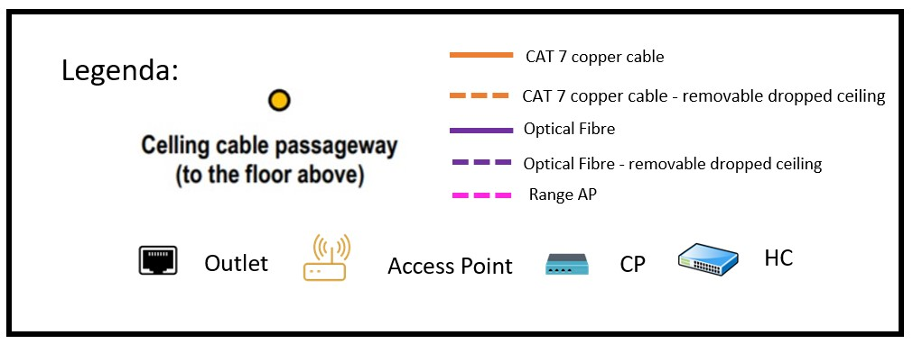

RCOMP 2021-2022 Project - Sprint 1 - Member 1201386 Folder
===========================================

## Edifício 1

### Medida do edifício:
- 30m × 20m = 600 metros quadrados

## Edifico 1 - Piso 0

### Medida da escala:

- 5m (real) = 2,7cm (escala)

### Informações Calculadas: 
| Room  |	Largura (m)     |Comprimento (m) | Área (m2)  |Quantidade de outlets |
|-------|-------------------|----------------|------------|----------------------|
|1.0.1  |6,6667          	|3,0556     	 |20,3708	  |	6	            	 |
|1.0.2  |6,6667          	|4,4444     	 |29,6295	  |	0	           	     |
|1.0.3  |6,6667          	|4,4444     	 |29,6295	  |	6	            	 |
|1.0.4  |6,6667          	|6,6667     	 |44,4449	  |	10	            	 |
|1.0.5  |5              	|3,0556     	 |15,278	  |	4	            	 |
|1.0.6  |5               	|3,0556     	 |15,278	  |	4	            	 |
|1.0.7  |5               	|3,0556     	 |15,278	  |	4	            	 |
|1.0.8  |5               	|5          	 |25    	  |	6	            	 |
|1.0.9  |4,6296          	|5,9259     	 |27,4345	  |	6	            	 |
|1.0.10 |7,2222          	|5,9259     	 |42,798	  |	10	            	 |

### Plano Esquemático:

### Legenda:

### Justificações Relevantes:
  
#### Outlets

- As áreas comuns, como o átrio de entrada, as casas de banho e as escadas, não
  necessitam de outlets.
  
- A distribuição dos outlets foi realizada tendo em consideração os melhores locais
  para que o room em questão não fosse muito afetado, para que não ficassem próximas de portas
  e para que seja possível com maior facilidade aproveitar o meio da sala para trabalhar.

- No posicionamento dos outlets foi também pensado de modo que entre os mesmos, a distância máxima seja
  de três metros, para que em qualquer parte da sala onde o equipamento do utilizador se encontre
  consiga com o patch cord que é fornecido ter acesso a uma tomada de rede.
  
- A quantidade de outlets por room foi obtida utilizando a proporção de 2 outlets para cada 
  10 metros quadrados de área.

#### Access Points

- Neste andar apenas foi colocado um access point, dado as dimensões do edifício.

- Os Access Points são conectados a um outlet através de um cabo de cobre CAT7 e concede uma cobertura circular de aproximadamente 50 m de
   diâmetro.

- O canal para o AP deste piso será o 11, para evitar interferências entre sinais.

- A sua localização foi pensada tendo em atenção também que o sinal dos access points pode ser acessado nos dois pisos.

##### Alcance do Access Point

####  Consolidation Points

- Ao todo neste piso temos 2 Consolidation Points. 
  Um na sala 1.0.7, que é responsável por controlar as salas 1.0.5, 1.0.6, 1.0.7 e 1.0.8 e pela tomada para o access point, ficando responsável por 19 outlets.
  O outro encontra-se na sala 1.0.9, que é responsável por controlar as salas 1.0.9 e 1.0.10, ficando responsável por 16 outlets.
  
- A ligação do HC com os CP's é feita através do underfloor cable raceway.

####  Horizontal cross-connect

- Este piso apresenta apenas um HC, pois este tem uma cobertura de cerca de 1000 metros
  quadrados e o edifício apresenta apenas 600 metros quadrados de área.
  
- O datacentre do edifício e do campus está localizado na sala 1.0.2 portanto o Horizontal cross-connect
  foi colocado nesta sala localizado no mesmo armário técnico que o Intermediate cross-connect.
  
- O comprimento de cada cabo é inferior a 90 m.

- A distância em linha reta entre o HC e o outlet inferior a 80 m.
####  Intermediate cross-connect

- O datacentre do edifício e do campus está localizado na sala 1.0.2 portanto o Intermediate cross-connect
  foi colocado nesta sala localizado no mesmo armário técnico que o Horizontal cross-connect.
  
- O IC recebe fibra ótica do MC e passa a fibra ótica para os dois HC's deste edifício.

- Cabos entre o HC e o IC limitados a 500m.
####  Main cross-connect

- O datacentre do edifício e do campus está localizado na sala 1.0.2 portanto o main cross-connect
  foi colocado nesta sala. 
  
- O Main cross-connect é responsável por distribuir para o Intermediate cross-connect deste edifício e dos outros
  a fibra ótica monomodo através da passagem para o exterior, por este motivo do MC sai 1 cabo de fibra ótica monomodo
  que se conecta ao IC deste edifício e 4 cabos para os IC's dos outros edifícios e chega 1 fio da entrada do campus até ao MC.
  
- Cabos entre o MC e o IC limitados a 1500m.
  
#### Cabos Utilizados e Respetivas Quantidades

- O tipo de cabo utilizado é Copper cable CAT7, para ligar HC's/CP's a outlets.

- Devido a não existirem custos associados ao projeto e a uma maior velocidade da transmissão, optei por fazer a ligação entre
  o HC e os CP's com cabo de fibra ótica monomodo de 8 fios, para ter em conta também a redundância.

- Usa-se Fibra Ótica monomodo de 8 fios na ligação do IC ao HC e do MC ao IC.

##### Cabo de Cobre CAT7

###### Sala 1.0.1

| Outlet | Quantidade de cabo CAT 7 necessário desde o HC até ao outlet (m)|
|--------|-----------------------------------------------------------------|
| 1      | 8,55                                                            |
| 2      | 10,87                                                           |
| 3      | 10,96                                                           |
| 4      | 13,28                                                           |
| 5      | 13,36                                                           |
| 6      | 15,69                                                           |

Obtendo-se um total de 72,71 m de cabo CAT 7.

###### Sala 1.0.3

| Outlet | Quantidade de cabo CAT 7 necessário desde o HC até ao outlet (m)|
|--------|-----------------------------------------------------------------|
| 1      | 4,85                                                            |
| 2      | 7,43                                                            |
| 3      | 7,26                                                            |
| 4      | 9,84                                                            |
| 5      | 9,67                                                            |
| 6      | 12,25                                                           | |

Obtendo-se um total de 51,3 m de cabo CAT 7.

###### Sala 1.0.4

| Outlet | Quantidade de cabo CAT 7 necessário desde o HC até ao outlet (m)|
|--------|-----------------------------------------------------------------|
| 1      | 9,75                                                            |
| 2      | 12,15                                                           |
| 3      | 14,55                                                           |
| 4      | 11,79                                                           |
| 5      | 14,19                                                           |
| 6      | 16,61                                                           |
| 7      | 13,83                                                           |
| 8      | 16,23                                                           |
| 9      | 18,65                                                           |
| 10     | 17,7                                                            |

Obtendo-se um total de 145,45 m de cabo CAT 7.

###### Sala 1.0.5

| Outlet | Quantidade de cabo CAT 7 necessário desde o CP até ao outlet (m)|
|--------|-----------------------------------------------------------------|
| 1      | 11,88                                                           |
| 2      | 14,2                                                            |
| 3      | 14,1                                                            |
| 4      | 16,42                                                           |

Obtendo-se um total de 56,6 m de cabo CAT 7.

###### Sala 1.0.6

| Outlet | Quantidade de cabo CAT 7 necessário desde o CP até ao outlet (m)|
|--------|-----------------------------------------------------------------|
| 1      | 8,72                                                            |
| 2      | 11,04                                                           |
| 3      | 10,94                                                           |
| 4      | 13,26                                                           |

Obtendo-se um total de 43,96 m de cabo CAT 7.

###### Sala 1.0.7

| Outlet | Quantidade de cabo CAT 7 necessário desde o CP até ao outlet (m)|
|--------|-----------------------------------------------------------------|
| 1      | 3,96                                                            |
| 2      | 3,96                                                            |
| 3      | 6,18                                                            |
| 4      | 6,18                                                            |

Obtendo-se um total de 20,28 m de cabo CAT 7.

###### Sala 1.0.8

| Outlet | Quantidade de cabo CAT 7 necessário desde o CP até ao outlet (m)|
|--------|-----------------------------------------------------------------|
| 1      | 6,1                                                             |
| 2      | 8,1                                                             |
| 3      | 8,1                                                             |
| 4      | 10,1                                                            |
| 5      | 10,1                                                            |
| 6      | 12,1                                                            |

Obtendo-se um total de 54,6 m de cabo CAT 7.

###### Sala 1.0.9

| Outlet | Quantidade de cabo CAT 7 necessário desde o CP até ao outlet (m)|
|--------|-----------------------------------------------------------------|
| 1      | 3,91                                                            |
| 2      | 6,13                                                            |
| 3      | 6,13                                                            |
| 4      | 5,95                                                            |
| 5      | 8,17                                                            |
| 6      | 8,17                                                            |

Obtendo-se um total de 38,46 m de cabo CAT 7.

###### Sala 1.0.10

| Outlet | Quantidade de cabo CAT 7 necessário desde o CP até ao outlet (m)|
|--------|-----------------------------------------------------------------|
| 1      | 3,55                                                            |
| 2      | 5,77                                                            |
| 3      | 7,99                                                            |
| 4      | 7,99                                                            |
| 5      | 7,99                                                            |
| 6      | 10,21                                                           |
| 7      | 10,21                                                            |
| 8      | 10,21                                                            |
| 9      | 12,43                                                            |
| 10     | 12,43                                                            |

Obtendo-se um total de 88,78 m de cabo CAT 7.

###### Access Point

| Outlet | Quantidade de cabo CAT 7 necessário desde o CP até ao outlet (m)|
|--------|-----------------------------------------------------------------|
| 1      | 21,43                                                           |

Obtendo-se um total de 21,43 m de cabo CAT 7.

##### Cabo Fibra Ótica

- A quantidade de cabo de fibra ótica necessária desde o CP que se encontra na sala 1.0.9
  até o HC do piso é de 36,34 m. 
  
- A quantidade de cabo de fibra ótica necessária desde o CP que se encontra na sala 1.0.7
  até o HC do piso é de 35,09 m.

- A quantidade de cabo de fibra ótica necessária desde o MC até o IC do edifício é de 4,85 m.

- A quantidade de cabo de fibra ótica necessária desde o IC e o HC do piso é de 0,5 m.

- A quantidade de cabo de fibra ótica necessária desde o MC até a saída do edifício é de 13,17 m, 
  para apenas um fio.

Obtendo-se um total de 195,31 m de cabo de fibra ótica.

#### Gabinetes de Telecomunicações 

Encontram-se posicionados a 1,5 m do chão.

A estratégia de super dimensionamento aplicada foi a seguinte:

- Determinar o tamanho dos gabinetes de telecomunicações multiplicando por quatro
  a quantidade de espaço necessária para os patch-panels alojados e arredondar para o próximo
  tamanho disponível comercialmente.

Foi tido também em consideração que o número máximo a entrar num gabinete de telecomunicações é 200. 

##### Sala 1.0.2

- Visto esta ter associado 22 outlets, existirão 22 ligações logo será necessário um patch panel
  CAT7 de 24 portas, tendo este o tamanho de 1U.

- Visto que HC conecta-se ao IC e a 2 CP's precisará de um Fiber Patch Panel, tendo este o tamanho de 1U. 
  Como o IC conecta-se ao HC e ao MC através de cabo de fibra ótica será necessário mais um Fiber Patch Panel, 
  tendo este o tamanho de 1U.

- O espaço guardado para os equipamentos ativos terá um tamanho de 3U.

- Irá ser adicionado, para além do valor já calculado, um tamanho extra de 6U.

- Posto isto, o tamanho total para este gabinete de telecomunicações será de 12U.

Nesta sala existe outro gabinete de telecomunicações que será onde o MC ficará instalado.

- Será necessário um Fiber Patch Panel, tendo este o tamanho de 1U.

- O espaço guardado para os equipamentos ativos terá um tamanho de 1U.

- Irá ser adicionado, para além do valor já calculado, um tamanho extra de 2U.

- Posto isto, o tamanho total para este gabinete de telecomunicações será de 6U.

##### Sala 1.0.7

- Visto esta ter associado 19 outlets, existirão 19 ligações logo será necessário um patch panel
  CAT7 de 24 portas, tendo este o tamanho de 1U.

- Como optei que a ligação entre o HC e o CP fosse realizada com cabo de fibra ótica monomodo também será
  necessário 1 fibre patch panel, tendo este o tamanho de 1U.

- O espaço guardado para os equipamentos ativos terá um tamanho de 2U.

- Irá ser adicionado, para além do valor já calculado, um tamanho extra de 4U.

- Posto isto, o tamanho total para este gabinete de telecomunicações será de 9U.

##### Sala 1.0.9

- Visto esta ter associado 16 outlets, existirão 16 ligações logo será necessário um patch panel 
  CAT7 de 24 portas, tendo este o tamanho de 1U.
  
- Como optei que a ligação entre o HC e o CP fosse realizada com cabo de fibra ótica monomodo também será 
  necessário 1 fibre patch panel, tendo este o tamanho de 1U.
  
- O espaço guardado para os equipamentos ativos terá um tamanho de 2U.

- Irá ser adicionado, para além do valor já calculado, um tamanho extra de 4U.

- Posto isto, o tamanho total para este gabinete de telecomunicações será de 9U.

### Inventário Total Piso 0:

| Equipamento                                   |	Quantidade  |
|-----------------------------------------------|---------------|
|Cabo CAT7 (m)                                  |   593,57      |
|Cabo Fibra Ótica (m)                           |   195,31      |
|Copper Patch cords (m)                         |   357         |
|Fiber Patch cords (m)                          |   59,5        |
|Fiber Patch Panel 1U                       	|	5			|
|Outlets	                                    |	57		    |
|Patch Panel ISO 8877 1U (24 entradas)        	|	3			|
|RJ 45 Fêmea (2 por cada cabo de cobre)     	|	114			|
|RJ 45 Macho (2 por cada patch cord de cobre)	|   258         |
|Telecommunication Enclosure 6U 	            |	1			|
|Telecommunication Enclosure 9U 	            |	2			|
|Telecommunication Enclosure 12U             	|	1			|

#### Justificações Relevantes

- Para determinar a quantidade de patch cords, foi utilizado o número de patch panel ports * 0,5 m (3 × 24 × 0,5).
- Para determinar a quantidade de patch cords para outlets, foi considerado um patch cord de 5 m por cada outlet.

## Edifico 1 - Piso 1

### Medida da escala:

- 5m (real) = 2,7cm (escala)

### Informações Calculadas:
| Room  |	Largura (m)     |Comprimento (m) | Área (m2)  |Quantidade de outlets |
|-------|-------------------|----------------|------------|----------------------|
|1.1.1  |6,6667          	|3,0556     	 |20,3708	  |	0	            	 |
|1.1.2  |6,6667          	|7,5926     	 |50,6176	  |	12	            	 |
|1.1.3  |6,6667          	|8,5185     	 |56,7903	  |	12	            	 |
|1.1.4  |5               	|2,7778     	 |13,889	  |	4	            	 |
|1.1.5  |5               	|2,7778     	 |13,889	  |	4	            	 |
|1.1.6  |5               	|2,7778     	 |13,889	  |	4	            	 |
|1.1.7  |5               	|2,7778     	 |13,889	  |	4	            	 |
|1.1.8  |5               	|2,7778     	 |13,889	  |	4	            	 |
|1.1.9  |5               	|2,7778     	 |13,889	  |	4	            	 |
|1.1.10 |5               	|2,7778     	 |13,889	  |	4	            	 |
|1.1.11 |5               	|2,7778     	 |13,889	  |	4	            	 |
|1.1.12 |5               	|2,7778     	 |13,889	  |	4	            	 |
|1.1.13 |5               	|2,7778     	 |13,889	  |	4	            	 |
|1.1.14 |7,2222          	|5,9259     	 |42,798	  |	10	            	 |

### Plano Esquemático:

### Legenda:

### Justificações Relevantes:

#### Outlets

- A sala 1.1.1 é uma área de armazenamento e não são necessárias tomadas de rede lá,
  e o mesmo aplica-se às casas de banho e a áreas comuns como corredores e átrios.

- A distribuição dos outlets foi realizada tendo em consideração os melhores locais
  para que o room em questão não fosse muito afetado, para que não ficassem próximas de portas
  e para que seja possível com maior facilidade aproveitar o meio da sala para trabalhar.

- No posicionamento dos outlets foi também pensado de modo que entre os mesmos, a distância máxima seja
  de três metros, para que em qualquer parte da sala onde o equipamento do utilizador se encontre
  consiga com o patch cord que é fornecido ter acesso a uma tomada de rede.

- A quantidade de outlets por room foi obtida utilizando a proporção de 2 outlets para cada
  10 metros quadrados de área.
  
#### Access Points

- Neste andar apenas foi colocado um access point, dado as dimensões do edifício.

- Os Access Points são conectados a um outlet através de um cabo de cobre CAT7 e concede uma cobertura circular de aproximadamente 50 m de
  diâmetro.

- O canal para o AP deste piso será o 6, para evitar interferências entre sinais.

- A sua localização foi pensada tendo em atenção também que o sinal dos access points pode ser acessado nos dois pisos.

##### Alcance do Access Point

- Para a determinação do alcance do access point foi utilizado um diâmetro de 50 m.

#### Consolidation Points

- Ao todo neste piso temos 2 Consolidation Points.
  Um na sala 1.1.5, que é responsável por controlar as salas 1.1.4, 1.1.5, 1.1.6, 1.1.9, 1.1.10 e 1.1.11, ficando responsável por 24 outlets.
  O outro encontra-se na sala 1.1.8, que é responsável por controlar as salas 1.1.7, 1.1.8, 1.1.12, 1.1.13 e 1.1.14 e o outlet para o access point, ficando responsável por 27 outlets.
  
####  Horizontal cross-connect

- Este piso apresenta apenas um HC, pois o edifício apresenta apenas 600 metros quadrados de área
  e a regra é a de que em cada 1000 metros quadrados de área bruta tem de existir 1HC.

- O HC está localizado na sala 1.1.1 num armário técnico, visto o cliente ter dado a indicação que esta sala
  podia ser usada para abrigar uma cross-connect por ser uma área de armazenamento.

- O HC é responsável pelas salas 1.1.2 e 1.1.3.

- O comprimento de cada cabo é inferior a 90 m.

- A distância em linha reta entre o HC e o outlet inferior a 80 m.

#### Cabos Utilizados e Respetivas Quantidades

- O tipo de cabo utilizado é Copper cable CAT7, para ligar HC's/CP's a outlets.

- Devido a não existirem custos associados ao projeto e a uma maior velocidade da transmissão, optei por fazer a ligação entre 
  o HC e os CP's com cabo de fibra ótica monomodo de 8 fios, para ter em conta também a redundância. 
  
- Usa-se Fibra Ótica monomodo de 8 fios na ligação do IC ao HC.

##### Cabo de Cobre CAT 7

###### Sala 1.1.2

| Outlet | Quantidade de cabo CAT 7 necessário desde o HC até ao outlet (m)|
|--------|-----------------------------------------------------------------|
| 1      | 7,11                                                            |
| 2      | 9,01                                                            |
| 3      | 10,91                                                           |
| 4      | 12,81                                                           |
| 5      | 9,01                                                            |
| 6      | 10,91                                                           |
| 7      | 12,81                                                           |
| 8      | 14,71                                                           |
| 9      | 10,91                                                           |
| 10     | 12,81                                                           |
| 11     | 14,71                                                           |
| 12     | 16,61                                                           |

Obtendo-se um total de 142,32 m de cabo CAT 7.

###### Sala 1.1.3

| Outlet | Quantidade de cabo CAT 7 necessário desde o HC até ao outlet (m)|
|--------|-----------------------------------------------------------------|
| 1      | 14,98                                                           |
| 2      | 17,08                                                           |
| 3      | 19,48                                                           |
| 4      | 21,58                                                           |
| 5      | 16,88                                                           |
| 6      | 18,98                                                           |
| 7      | 21,38                                                           |
| 8      | 23,48                                                           |
| 9      | 18,78                                                           |
| 10     | 20,88                                                           |
| 11     | 23,28                                                           |
| 12     | 25,38                                                           |

Obtendo-se um total de 242,16 m de cabo CAT 7.

###### Sala 1.1.4

| Outlet | Quantidade de cabo CAT 7 necessário desde o HC até ao outlet (m)|
|--------|-----------------------------------------------------------------|
| 1      | 9,58                                                            |
| 2      | 9,58                                                            |
| 3      | 11,61                                                           |
| 4      | 11,61                                                           |

Obtendo-se um total de 42,38 m de cabo CAT 7.

###### Sala 1.1.5

| Outlet | Quantidade de cabo CAT 7 necessário desde o HC até ao outlet (m)|
|--------|-----------------------------------------------------------------|
| 1      | 3,32                                                            |
| 2      | 3,32                                                            |
| 3      | 5,35                                                            |
| 4      | 5,35                                                            |

Obtendo-se um total de 17,34 m de cabo CAT 7.

###### Sala 1.1.6

| Outlet | Quantidade de cabo CAT 7 necessário desde o HC até ao outlet (m)|
|--------|-----------------------------------------------------------------|
| 1      | 8,47                                                            |
| 2      | 8,47                                                            |
| 3      | 10,5                                                            |
| 4      | 10,5                                                           |

Obtendo-se um total de 37,94 m de cabo CAT 7.

###### Sala 1.1.7

| Outlet | Quantidade de cabo CAT 7 necessário desde o HC até ao outlet (m)|
|--------|-----------------------------------------------------------------|
| 1      | 5,8                                                             |
| 2      | 7,58                                                            |
| 3      | 9,61                                                            |
| 4      | 9,61                                                           |

Obtendo-se um total de 32,6 m de cabo CAT 7.

###### Sala 1.1.8

| Outlet | Quantidade de cabo CAT 7 necessário desde o HC até ao outlet (m)|
|--------|-----------------------------------------------------------------|
| 1      | 3,51                                                            |
| 2      | 5,29                                                            |
| 3      | 7,32                                                            |
| 4      | 7,32                                                            |

Obtendo-se um total de 23,44 m de cabo CAT 7.

###### Sala 1.1.9

| Outlet | Quantidade de cabo CAT 7 necessário desde o HC até ao outlet (m)|
|--------|-----------------------------------------------------------------|
| 1      | 9,95                                                            |
| 2      | 9,95                                                            |
| 3      | 11,98                                                           |
| 4      | 11,98                                                           |

Obtendo-se um total de 43,86 m de cabo CAT 7.

###### Sala 1.1.10

| Outlet | Quantidade de cabo CAT 7 necessário desde o HC até ao outlet (m)|
|--------|-----------------------------------------------------------------|
| 1      | 5,69                                                            |
| 2      | 5,69                                                            |
| 3      | 7,72                                                            |
| 4      | 7,72                                                            |

Obtendo-se um total de 26,82 m de cabo CAT 7.

###### Sala 1.1.11

| Outlet | Quantidade de cabo CAT 7 necessário desde o HC até ao outlet (m)|
|--------|-----------------------------------------------------------------|
| 1      | 8,84                                                            |
| 2      | 8,84                                                            |
| 3      | 10,87                                                           |
| 4      | 10,87                                                           |

Obtendo-se um total de 39,42 m de cabo CAT 7.

###### Sala 1.1.12

| Outlet | Quantidade de cabo CAT 7 necessário desde o HC até ao outlet (m)|
|--------|-----------------------------------------------------------------|
| 1      | 6,17                                                            |
| 2      | 7,95                                                            |
| 3      | 9,98                                                            |
| 4      | 9,98                                                           |

Obtendo-se um total de 34,08 m de cabo CAT 7.

###### Sala 1.1.13

| Outlet | Quantidade de cabo CAT 7 necessário desde o HC até ao outlet (m)|
|--------|-----------------------------------------------------------------|
| 1      | 5,91                                                            |
| 2      | 7,69                                                            |
| 3      | 9,72                                                            |
| 4      | 9,72                                                           |

Obtendo-se um total de 33,04 m de cabo CAT 7.

###### Sala 1.1.14

| Outlet | Quantidade de cabo CAT 7 necessário desde o CP até ao outlet (m)|
|--------|-----------------------------------------------------------------|
| 1      | 15,59                                                           |
| 2      | 17,81                                                           |
| 3      | 20,03                                                           |
| 4      | 20,03                                                           |
| 5      | 22,25                                                           |
| 6      | 20,03                                                           |
| 7      | 22,25                                                            |
| 8      | 24,47                                                            |
| 9      | 22,25                                                            |
| 10     | 24,47                                                            |

Obtendo-se um total de 209,18 m de cabo CAT 7.

###### Access Point

| Outlet | Quantidade de cabo CAT 7 necessário desde o CP até ao outlet (m)|
|--------|-----------------------------------------------------------------|
| 1      | 19,57                                                           |

Obtendo-se um total de 19,57 m de cabo CAT 7.

##### Cabo Fibra Ótica

- A quantidade de cabo de fibra ótica necessária desde o IC que se encontra no piso zero
  até o HC do piso 1 é de 15,72 m.

- A quantidade de cabo de fibra ótica necessária desde o CP que se encontra na sala 1.1.5
  até o HC do piso é de 20,15 m.

- A quantidade de cabo de fibra ótica necessária desde o CP que se encontra na sala 1.1.8
  até o HC do piso é de 29,41 m.

Obtendo-se um total de 65,28 m de cabo de fibra ótica.

#### Telecommunication Enclosure

A estratégia de super dimensionamento aplicada foi a seguinte: 

- Determinar o tamanho dos gabinetes de telecomunicações multiplicando por quatro 
  a quantidade de espaço necessária para os patch-panels alojados e arredondar para o próximo 
  tamanho disponível comercialmente.

Foi tido também em consideração que o número máximo a entrar num gabinete de telecomunicações é 200.

Encontram-se posicionados a 1,5 m do chão.

##### Sala 1.1.1

- Visto esta ter associado 24 outlets, existirão 24 ligações logo serão necessários dois patch panels
  CAT7 de 24 portas, tendo cada um destes o tamanho de 1U.

- Como optei que a ligação entre o HC e o CP fosse realizada com cabo de fibra ótica monomodo e como o HC 
  conecta-se ao IC também com cabo de fibra ótica, será necessário 1 fibre patch panel, tendo este o tamanho de 1U.

- O espaço guardado para os equipamentos ativos terá um tamanho de 3U.

- Irá ser adicionado, para além do valor já calculado, um tamanho extra de 6U.

- Posto isto, o tamanho total para este gabinete de telecomunicações será de 12U.

##### Sala 1.1.5

- Visto esta ter associado 24 outlets, existirão 24 ligações logo serão necessários dois patch panels
  CAT7 de 24 portas, tendo cada um destes o tamanho de 1U.

- Como optei que a ligação entre o HC e o CP fosse realizada com cabo de fibra ótica monomodo também será
  necessário 1 fibre patch panel, tendo este o tamanho de 1U.

- O espaço guardado para os equipamentos ativos terá um tamanho de 3U.

- Irá ser adicionado, para além do valor já calculado, um tamanho extra de 6U.

- Posto isto, o tamanho total para este gabinete de telecomunicações será de 12U.

##### Sala 1.1.8

- Visto esta ter associado 27 outlets, existirão 27 ligações logo serão necessários dois patch panels
  CAT7 de 24 portas, tendo cada um destes o tamanho de 1U.

- Como optei que a ligação entre o HC e o CP fosse realizada com cabo de fibra ótica monomodo também será
  necessário 1 fibre patch panel, tendo este o tamanho de 1U.

- O espaço guardado para os equipamentos ativos terá um tamanho de 3U.

- Irá ser adicionado, para além do valor já calculado, um tamanho extra de 6U.

- Posto isto, o tamanho total para este gabinete de telecomunicações será de 12U.

### Inventário Total Piso 1:

| Equipamento                                   |	Quantidade  |
|-----------------------------------------------|-------------- |
|Cabo CAT7 (m)                                  |   944,15      |
|Cabo Fibra Ótica (m)                           |   65,28       |
|Copper Patch cords (m)                         |   447         |
|Fiber Patch cords (m)                          |   36          |
|Fiber Patch Panel 1U           	        	|	3			|
|Outlets	                                    |	75  	    |
|Patch Panel ISO 8877 1U (24 entradas)	        |	6			|
|RJ 45 Fêmea (2 por cada cabo de cobre)     	|	150			|
|RJ 45 Macho (2 por cada patch cord de cobre)	|   438         |
|Telecommunication Enclosure 12U	            |	3			|

#### Justificações Relevantes

- Para determinar a quantidade de patch cords, foi utilizado o número de patch panel ports * 0,5 m.
- Para determinar a quantidade de patch cords para outlets, foi considerado um patch cord de 5 m por cada outlet.

### Inventário Total Do Edifício:

| Equipamento                                        |	Quantidade  |
|----------------------------------------------------|---------------|
| Cabo CAT7 (m)                                      |   1537,72     |
| Cabo Fibra Ótica (m)                               |   260,59      |
| Copper Patch cords (m)                             |   804         |
| Fiber Patch cords (m)                              |   95,5        |
| Fiber Patch Panel 1U            		                 |	8			|
| Outlets	                                           |	138		    |
| Patch Panel ISO 8877 1U (24 entradas)	             |	9			|
| RJ 45 Fêmea (2 por cada cabo de cobre)     	       |	264			|
| RJ 45 Macho (2 por cada patch cord de cobre)	      |   696         |
| Telecommunication Enclosure 6U      	              |	1			|
| Telecommunication Enclosure 9U     	               |	2			|
| Telecommunication Enclosure 12U	                   |	4			|

