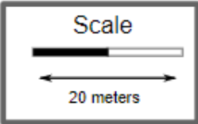
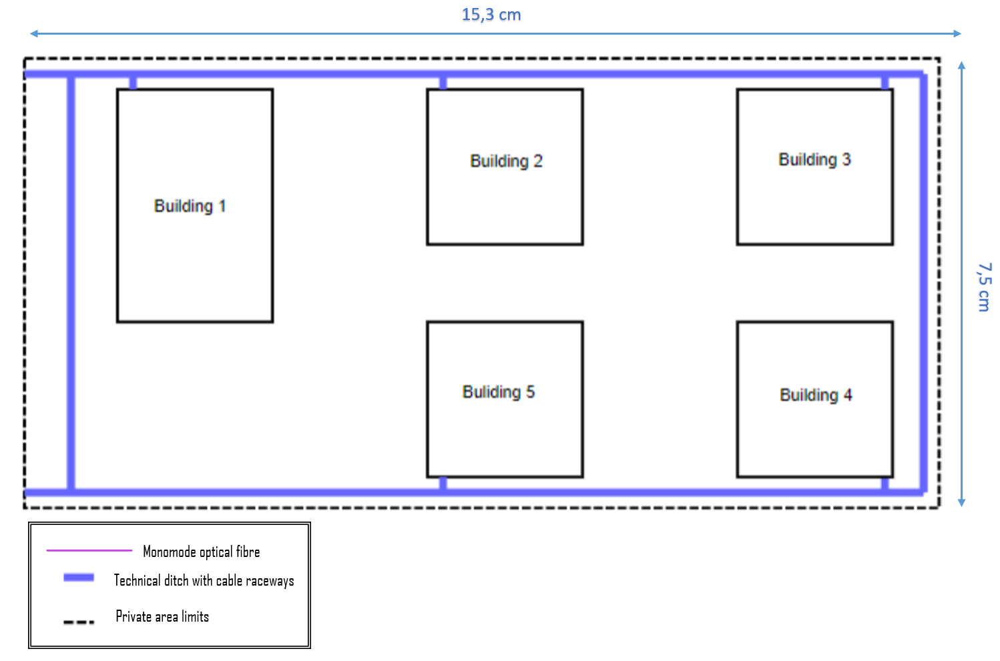
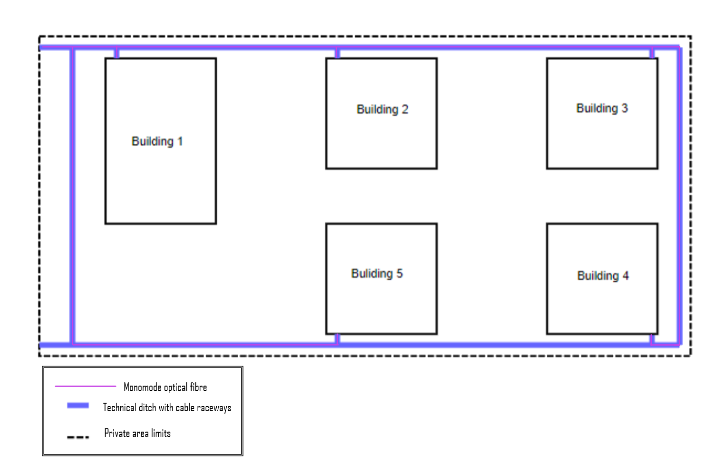

RCOMP 2021-2022 Project - Sprint 1 - Campus Folder 
===========================================

## Campus 

### Scale measure:

- 2,6 cm (scale) = 20m (reality)

### Campus measurement:

| Length (m) | Width(m) | Area(m2) | 
|------------|----------|----------|
| 117,69     | 57,69    | 6789,94  |

### Calculated information:
| Build | Length (m) | Width (m) | Area (m2) |
|-------|------------|-----------|-----------|
| 1     | 30         | 20        | 600       |
| 2     | 20         | 20        | 400       |
| 3     | 20         | 20        | 400       |
| 4     | 20         | 20        | 400       |
| 5     | 20         | 20        | 400       |

### Cable path layout:

| Build | Amount of monomode optical fiber needed to reach the MC |
|-------|---------------------------------------------------------|
| 1     | -                                                       |
| 2     | 44,64                                                   |
| 3     | 100,77                                                  |
| 4     | 163,85                                                  |
| 5     | 113,08                                                  |

* You will need a fiber cable that comes from outside the campus to be connected to the MC which is located in building 1. This cable will have a 16.15m path.

* A manual failover will also be implemented with a second fiber cable parallel to the main one, so the values in the table above will be duplicated.

### Total inventory:

| Equipment                              | Quantity  |
|----------------------------------------|-----------|
| Monomode optical fibre                 | 1667,64 m |
| Copper cable (CAT7)                    | 6145,84 m |
| Outlets                                | 413       |
| Copper patch cords (5m)                | 352       |
| Fibre patch cords (0,5m)               | 312       |
| Copper patch cords (0,5m)              | 508       |
| Acess-point                            | 7         |
| 16U size telecommunications enclosures | 2         |
| 12U size telecommunications enclosures | 5         |
| 9U size telecommunications enclosures  | 9         |
| 6U size telecommunications enclosures  | 8         |
| Copper patch panel with 24 inputs      | 26        |
| Fiber Path Panel with 24 inputs        | 18        |
