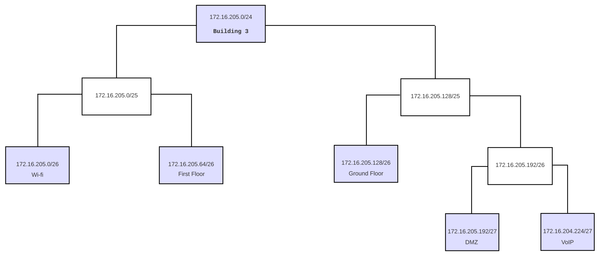
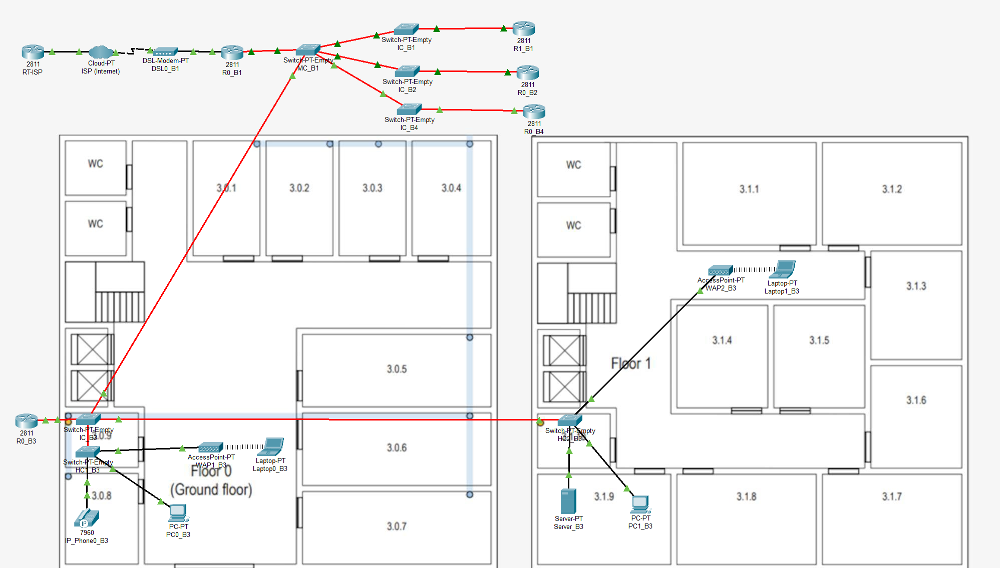
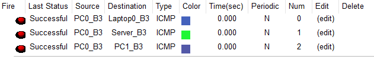
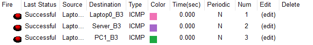
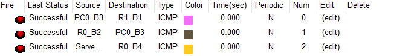
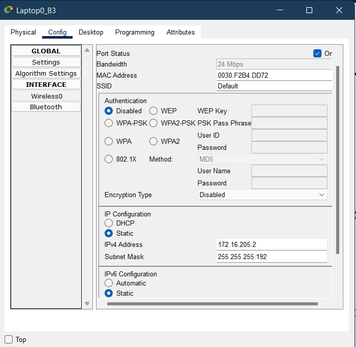
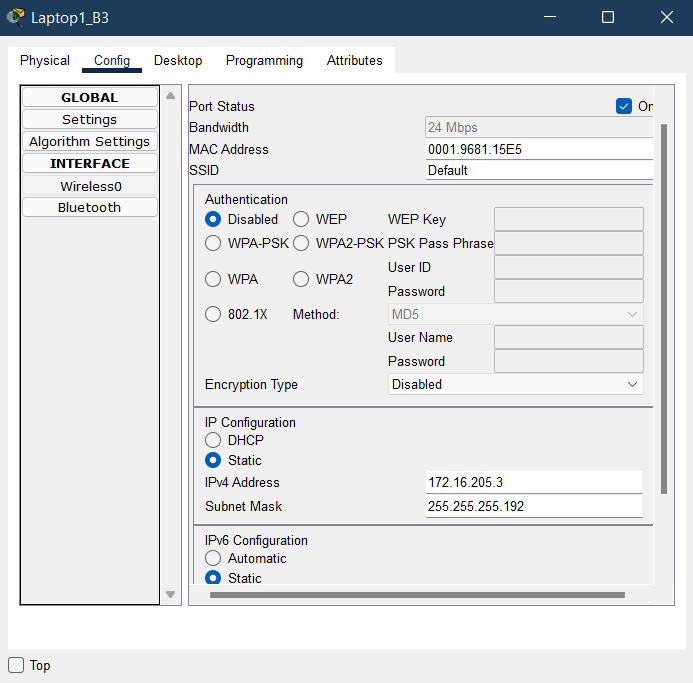

RCOMP 2021-2022 Project - Sprint 2 - Member 1200720 folder
===========================================

# Building 3 #

### VLAN database and IPv4 network ###

**Figure 1: Distribution of network addresses for building 3.**

|              | VLAN ID | VLAN Name     | TOTAL NODES | NETMASK | IP             | FIRST IP       | LAST IP        | BROADCAST      |
|--------------|---------|---------------|-------------|---------|----------------|----------------|----------------|----------------|
| Wi-fi        | 253     | b3wifi        | 55          | /26     | 172.16.205.0   | 172.16.205.1   | 172.16.205.62  | 172.16.205.63  |
| First Floor  | 252     | b3firstfllor  | 45          | /26     | 172.16.205.64  | 172.16.205.65  | 172.16.205.126 | 172.16.205.127 |
| Ground Floor | 251     | b3groundfloor | 35          | /26     | 172.16.205.128 | 172.16.205.129 | 172.16.205.190 | 172.16.205.191 |
| DMZ          | 254     | b3dmz         | 28          | /27     | 172.16.205.192 | 172.16.205.193 | 172.16.205.222 | 172.16.205.223 |
| VoIP         | 255     | b3voip        | 25          | /27     | 172.16.205.224 | 172.16.205.225 | 172.16.205.254 | 172.16.205.255 |

* The networks were sorted in descending order of nodes, thus filling the largest number of addresses without them being wasted.

* According to the presented diagram, there are still 58 nodes which have available unused IP's, allowing for future expansion.

### Packet Tracer ###

**Figure 2: Building 3.pkt simulation.**

* The approach taken complies with what was established in Sprint 1.
* As requested, the simulation allows communication between the different VLANs and communication with the ISP. Each router forward any address it doesn't know to the MC's present router and this router forwards it to each building or forwards it to the ISP via a DSL Modem.
* All *switches* were configured to have the number of ports needed to establish the connections specified in the statement (**FFE** ports for fiber cables and **FCE** ports for copper cables).
* All connections between switches were changed to truck mode, the vtp domain changed to the domain provided in the statement, and the MC switch configured in server mode, the rest being configured in client mode, thus allowing all switches in all buildings to have in your VLAN database all the configured VLANs.
* To confirm that everything is confirmed, two images are displayed that show the success of pings between the same building and between other buildings and the ISP.

**Figure 3: Pings between PC0 and building 3.**

**Figure 4: Pings between Laptop1 and building 3.**

**Figure 5: Pings between buildings.**

* The IP's of the laptops were configured but even when saving the project they are erased. Because of this, they have to be defined whenever we start the project. Below are the two assigned ip's.

**Figure 6: Laptop0_B3 settings.**

**Figure 7: Laptop1_B3 settings.**

### Switches and Routers Configuration Files ###

* The configuration files of all switches and routers necessary for the proper functioning of the structured cabling project of building 3 can be found in this link: [Configuration Files Folder](config-files) 

## Network Configuration ##

### Backbone ###

The campus backbone is represented in the simulation through the **MC_B1** Switch (corresponding to the main-cross connect of the campus), by the various IC Switches of all buildings on the campus and by the router of building 3, since it is the responsible for communication between the various buildings on the campus (information from Sprint1).

As in the 1st Sprint, data transmission to the buildings was carried out through an inter-cross connects connection, represented by Switch **IC_B3**, the horizontal connects, represented by Switches **HC1_B3** and ** HC2_B3**, and from these to the end-devices. It should be noted that the MC-IC, IC-HC, HC-HC connections were made using fiber cable, for that it was necessary to use **FFE** adapters in the Switches and in the Router, **R0_B3** , which is connected to **IC_B3**. The connection between the HC-Outlets was made using copper cable.

### Internet Connection 

Representing the Internet connection is a ***Cloud***, a ***router* ISP** and a ***Modem***, respecting the configuration shown in PL3. Router A is finalizing the Internet connection, having been the chosen point of contact between the Internet from the elements presented above and the *network* inside.

### Building Specifications ###

The implementation of the proposed requirements for building 3 starts from the *Switch* of *hostname* **IC_B3** that establishes a connection to two other *switches* representing floors 0 and 1 (**HC1_B3** and ** HC2_B3** respectively). All *switches* were configured to have the number of ports necessary to establish the connections specified in the statement (**FGE** ports for fiber cables and **FCE** ports for copper cables).

All ports that are not connected to *end-devices* are configured in ***trunk mode*** (in the case of *switch* IC_B3), being the type of port indicated to establish a connection to multiple VLANs. On the other hand, the ports that connect with *end-devices* are configured in ***access mode***, as they only connect to a single VLAN.

In the configurations of the two **HC's** of the building, the following VLANs were associated to the end-devices:

1. **VLAN 251: b3groundfloor**, represented by device **PC0_B3**;
2. **VLAN 252: b3firstfllor**, represented by device **PC1_B3**;
3. **VLAN 253: b3wifi**, represented by **WAP0_B3** and **WAP1_B3** devices, each with a **LAPTOP** connected to it;
4. **VLAN 254: b3dmz**, represented by device **Server0_B3**.
5. **VLAN 255: b3voip**, represented by the device **IP_Phone0_B3**.

Since the main objective of the Sprint was to present a logical implementation plan for the network and for interpretation reasons, we chose not to present the total amount of *nodes* indicated in the statement. Thus, each ***end-device*** presented in the simulation represents the totality of devices that would be needed:

* **PC0_B3**: 35 *nodes*;
* **PC1_B3**: 45 *nodes*;
* **WAP0_B3**: 27 *nodes*;
* **WAP1_B3**: 28 *nodes*;
* **IP_Phone0_B3**: 25 *nodes*;
* **Server0_B3**: 28 *nodes*;

## Routing Tables ##

#### Building 3 - R0_B3 (172.16.200.3/25) ###

| Network     | Next Hop      |
|-------------|---------------|
| 0.0.0.0/0   | 172.16.200.6  |

#### Building 1 MC - R0_B1 (172.16.200.6/25) ###

| Network           | Next Hop          |
|-------------------|-------------------|
| 172.16.201.0/24   | 172.16.200.1      |
| 172.16.204.0/24   | 172.16.200.2      |
| 172.16.205.0/24   | 172.16.200.3      |
| 172.16.206.0/24   | 172.16.200.4	     |
| 172.16.200.128/25 | 172.16.200.1      |
| 172.16.202.0/25   | 172.16.200.1      |
| 0.0.0.0/0         | 15.203.47.93    	 |

#### ISP - RT-ISP (15.203.47.93/30) ###

| Network          | Next Hop      |
|------------------|---------------|
| 172.16.200.0/21  | 15.203.47.94  |

