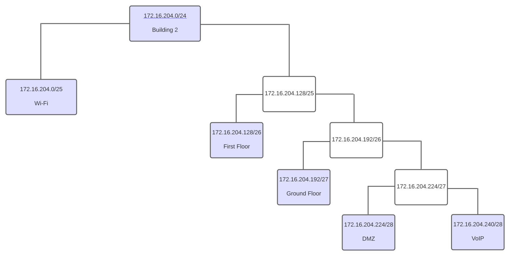
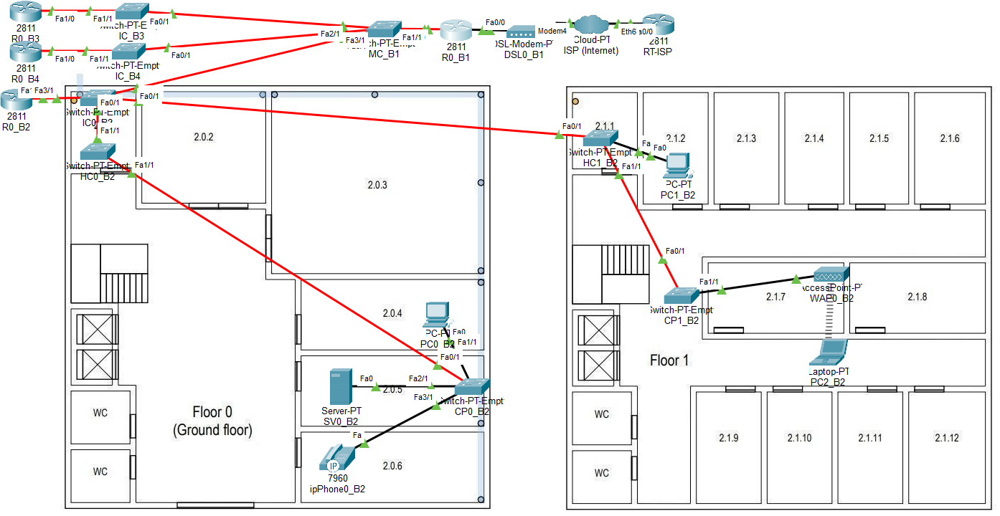
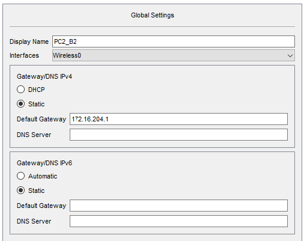
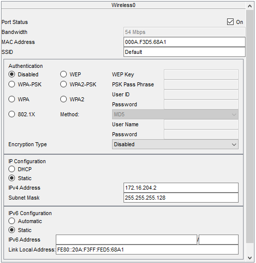
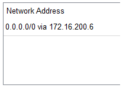

RCOMP 2021-2022 Project - Sprint 2 - Member 1201239 folder
===========================================

# Building 2

### VLAN Database and IPv4 Network

## VLAN Database and IPv4 Network Table ##

|                | VLAN ID | VLAN Name     | TOTAL NODES | IP                 | FIRST IP          | LAST IP           | BROADCAST         |
|----------------|---------|---------------|-------------|--------------------|-------------------|-------------------|-------------------|
|Wi-Fi           | 248     | b2wifi        | 120         | 172.16.204.0/25    | 172.16.204.1/25   | 172.16.204.126/25 | 172.16.204.127/25 |
|First Floor     | 247     | b2floorone    | 50          | 172.16.204.128/26  | 172.16.204.129/26 | 172.16.204.190/26 | 172.16.204.191/26 |
|Ground Floor    | 246     | b2groundfloor | 25          | 172.16.204.192/27  | 172.16.204.193/27 | 172.16.204.222/27 | 172.16.204.223/27 |
|DMZ             | 249     | b2dmz         | 12          | 172.16.204.224/28  | 172.16.204.225/28 | 172.16.204.238/28 | 172.16.204.239/28 |
|VoIP            | 250     | b2voip        | 12          | 172.16.204.240/28  | 172.16.204.241/28 | 172.16.204.254/28 | 172.16.204.255/28 |

> According to the presented diagram, there are still 37 nodes which have available unused IP's, allowing for future expansion.

#Packet Tracer Simulation

#Network Configuration

## Backbone

The Campus Backbone is represented in through the Building 1 Main-Cross Connect and its respective connections, including the used routers to offer a network interface in-campus and to the internet.

A Cloud, the ISP Router and a Modem represent the connection to the internet (according to the PL3 contents). The ISP router is responsible for providing the internet interface for all its client's sublayers.

## Specifications

Since the Campus's MC (MC_B1) is housed in Building 1 to the Building 2 IC (IC_B1). 
The building 2 IC is then connected to each floor's HC (HC0_B2 and HC1_B2), which then connect to end devices or Consolidation Points (CP0_B2).
Then, each end device is connected to the respective port on the switch.\
Vertical Connections between these switches were made in Trunk mode. Access mode was only used when connecting to end devices.\
On the switches, it was only used the necessary number of ports (FGE for fiber connections and FCE for copper connections) and the only devices
that are connected through copper are end devices, such as Laptops, Workstations or Access Points.

| VLAN | Device (example) |
|------|------------------|
| 246  | PC0_B2           |
| 247  | PC1_B2           |
| 248  | LAPTOP0_B2       |
| 249  | SV0_B2           |
| 250  | ipPhone0_B2      |

> Laptop Configurations would not save when exiting the Packet Tracer Simulation Software. Due to that, this is a representation of the used configurations for it:

## Switches Configuration Files ##

[Configuration Files Folder](configFiles)

## Routing Tables ##

#### Building 2 - R0_B2 (172.16.200.2/25) ###

| Network   | Next Hop     |
|-----------|--------------|
| 0.0.0.0/0 | 172.16.200.6 |

#### ISP - RT-ISP (15.203.47.93/30) ###

| Network         | Next Hop     |
|-----------------|--------------|
| 172.16.200.0/21 | 15.203.47.94 |

