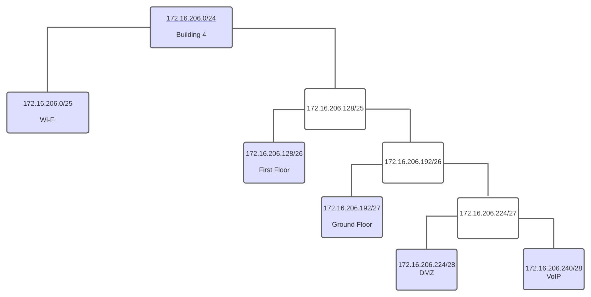
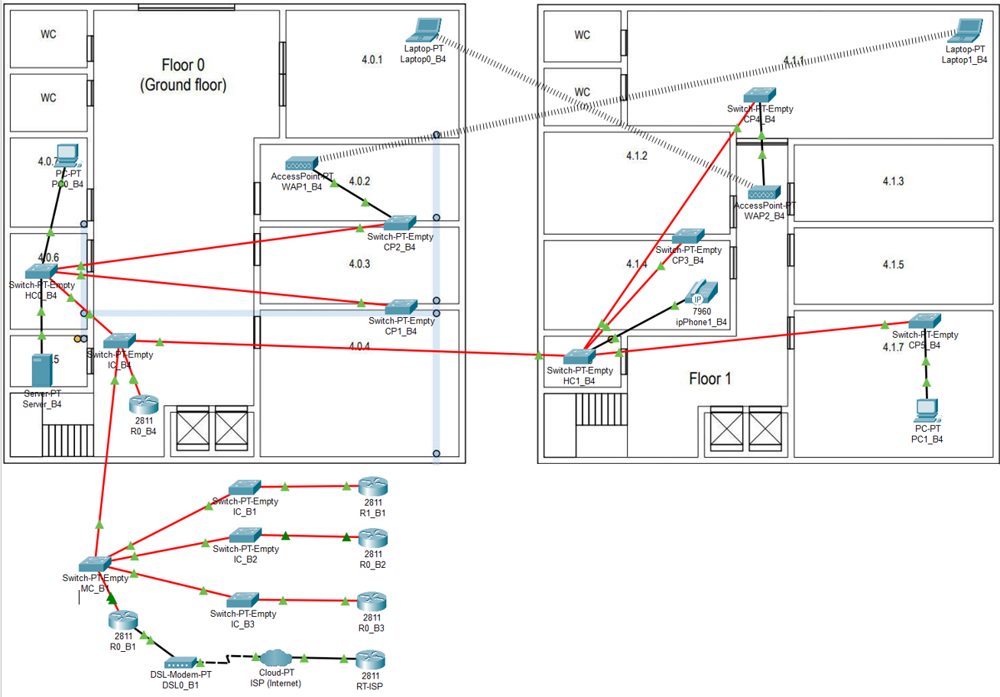
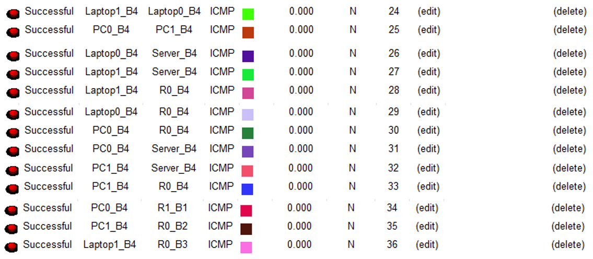

RCOMP 2021-2022 Project - Sprint  - Member 1201382 folder
===========================================

# Edifício 4

### VLAN database and IPv4 network

|                |VLAN ID |VLAN Name      | TOTAL NODES  | IP               | FIRST IP         | LAST IP          |  BROADCAST          |
|----------------|--------|---------------|--------------|------------------|------------------|------------------|---------------------|
|Wi-Fi           |258     | b4wifi        |70            |172.16.206.0/25   |172.16.206.1/25   |172.16.206.126/25 |172.16.206.127/25    |
|First Floor     |257     | b4floorone    |55            |172.16.206.128/26 |172.16.206.129/26 |172.16.206.190/26 |172.16.206.191/26    |
|Ground Floor    |256     | b4groundfloor |28            |172.16.206.192/27 |172.16.206.193/27 |172.16.206.222/27 |172.16.206.223/27    |
|DMZ             |259     | b4dmz         |10            |172.16.206.224/28 |172.16.206.225/28 |172.16.206.238/28 |172.16.206.239/28    |
|VoIP            |260     | b4voip        |12            |172.16.206.240/28 |172.16.206.241/28 |172.16.206.254/28 |172.16.206.255/28    |

#Packet Tracer Simulation

* As requested, the simulation allows communication between the different VLANs and communication with the ISP. 
* Each router forward any address it doesn't know to the MC's present router and this router forwards it to each building or forwards it to the ISP via a DSL Modem.
* All switches were configured to have the number of ports needed to establish the connections specified in the statement (FFE ports for fiber cables and FCE ports for copper cables).
* All connections between switches were changed to truck mode, the vtp domain changed to the domain provided in the statement, and the MC switch configured in server mode, the rest being configured in client mode, thus allowing all switches in all buildings to have in your VLAN database all the configured VLANs.
* The Internet connection is represented through a Cloud, an ISP router and a Modem, Respecting the configuration shown in PL3.

* The IP's of the laptops were configured but even when saving the project they are erased. Because of this, they have to be defined whenever we start the project. Below are the two assigned ip's.

|                | IPv4 address        | Subnet Mask |
|----------------|---------------------|-------------|
|Laptop0_B4      |172.16.206.2         | 255.255.255.128 |
|Laptop1_B4      |172.16.206.3         | 255.255.255.128 |
 
#Network Configuration

## Backbone

The campus backbone is represented in the simulation through the MC_B1 Switch (corresponding to the main-cross connect of the campus), by the various IC Switches of all buildings on the campus and by the router of building 4, since it is the responsible for communication between the various buildings on the campus (information from Sprint1).

As in the 1st Sprint, data transmission to the buildings was carried out through an inter-cross connects connection, represented by Switch IC_B4, the horizontal connects, represented by Switches HC0_B4 and ** HC1_B4**, and from these to the end-devices . 
It should be noted that the MC-IC, IC-HC, HC-HC connections were made using fiber cable, for that it was necessary to use FFE adapters in the Switches and in the Router, R0_B4 , which is connected to IC_B4. 
The connection between the HC-Outlets was made using copper cable.

## Specifications

The implementation of the proposed requirements for building 4 starts from the _Switch_ of _hostname_ **IC-B4** that establishes a connection to two other _switches_ representing floors 0 and 1 (**HC0-B4** and **HC1- B4** respectively). 
All _switches_ were configured to have the number of ports necessary to establish the connections specified in the statement (**FGE** ports for fiber cables and **FCE** ports for copper cables).

All ports that **are not connected to _end-devices_**, are configured in **_trunk mode_** (in the case of _switch_ ICC-B4), being the type of port indicated to establish a connection to several VLANs. On the other hand, the ports that connect with _end-devices_ are configured in **_access mode_**, as they only connect to a single VLAN.

| VLAN | Device (example) |
|------|------------------|
| 256  | PC0_B4           |
| 257  | PC1_B4           |
| 258  | Laptop0_B4       |
| 258  | Laptop1_B4       |
| 259  | Server_B4        |
| 260  | ipPhone1_B4      |

Since the main objective of the Sprint was to present a logical implementation plan for the network and for interpretation reasons, we chose not to present the total amount of nodes indicated in the statement. Thus, each end-device presented in the simulation represents the totality of devices that would be needed:

* **B4-F0**: 28 _nodes_;
* **B4-F1**: 55 _nodes_;
* **WAP0_B4**: 35 _nodes_;
* **WAP1_B4**: 35 _nodes_;
* **ipPhone1_B4**: 12 _nodes_;
* **Server_B4**: 10 _nodes_;

## Connections Success ##

## Switches Configuration Files ##

[Configuration Files Folder](configFiles)

## Routing Tables ##

#### Building 1 MC - R0_B1 (172.16.200.6/25) ###

| Network               | Next Hop                  |
|-----------------------|---------------------------|
| 172.16.201.0/24 		|		172.16.200.1		|
| 172.16.204.0/24		|		172.16.200.2		|
| 172.16.205.0/24 		|		172.16.200.3		|
| 172.16.206.0/24		|	    172.16.200.4	  	|
| 172.16.200.128/25 	|		172.16.200.1		|
| 172.16.202.0/25		|		172.16.200.1		|
| 0.0.0.0/0 			|		15.203.47.93    	|

#### Building 4 - R0_B4 (172.16.200.4/25) ###

| Network               | Next Hop                  |
|-----------------------|---------------------------|
| 0.0.0.0/0 			|		172.16.200.6		|

#### ISP - RT-ISP (15.203.47.93/30) ###

| Network               | Next Hop                  |
|-----------------------|---------------------------|
| 172.16.200.0/21 	    |		15.203.47.94		|

