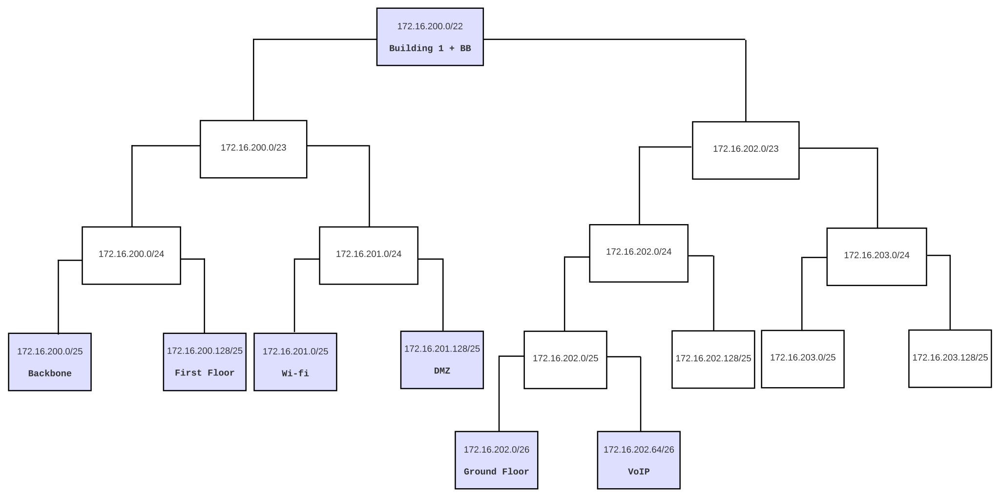
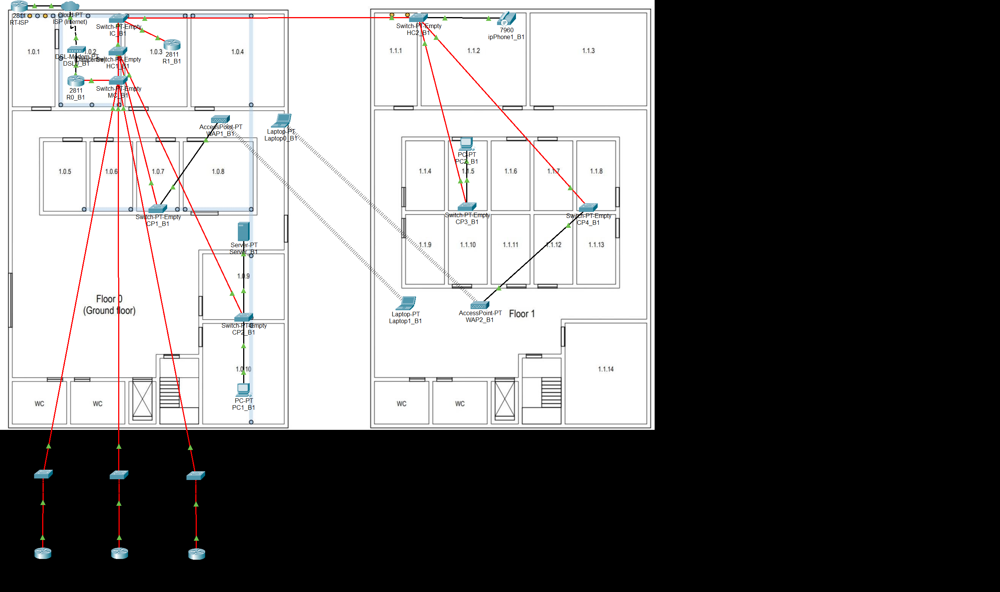
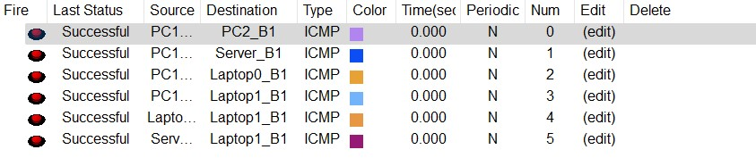
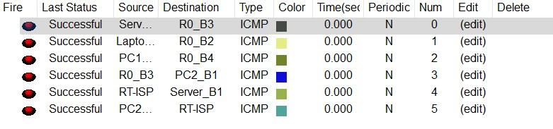
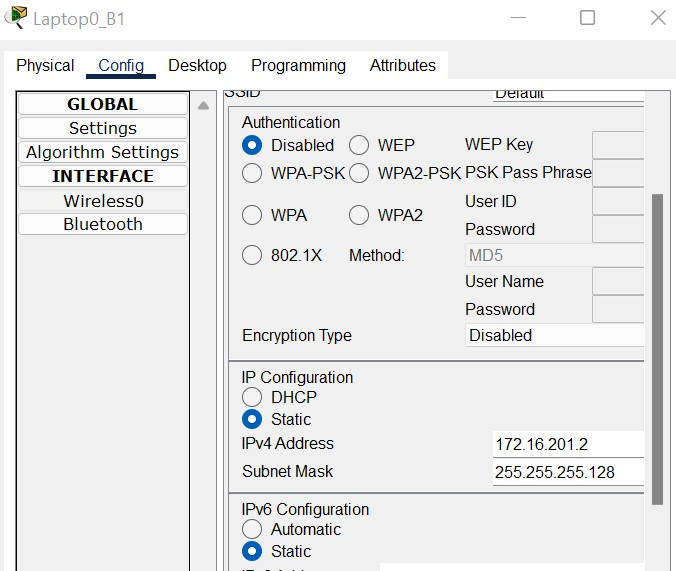
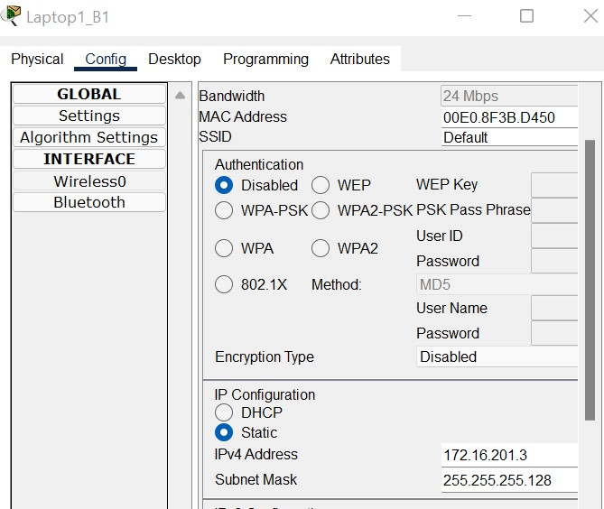
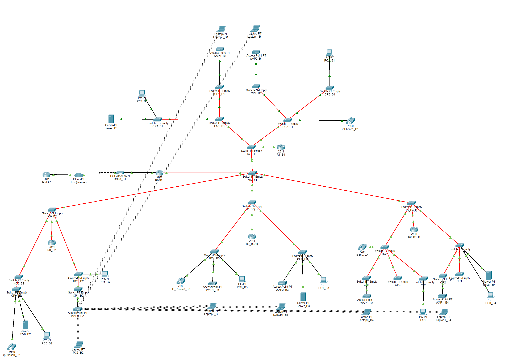

RCOMP 2021-2022 Project - Sprint  - Member 1201386 folder
===========================================

# Building 1

### VLAN database and IPv4 network

**Figure 1: Distribution of network addresses for building 1.**

|                |VLAN ID |VLAN Name      | TOTAL NODES  | IP               | FIRST IP         | LAST IP          |  BROADCAST          |
|----------------|--------|---------------|--------------|------------------|------------------|------------------|---------------------|
|Backbone        |240     | backbone      |120           |172.16.200.0/25   |172.16.200.1/25   |172.16.200.126/25 |172.16.200.127/25    |
|First Floor     |242     | b1floorone    |80            |172.16.200.128/25 |172.16.200.129/25 |172.16.200.254/25 |172.16.200.255/25    |
|Wi-Fi           |243     | b1wifi        |120           |172.16.201.0/25   |172.16.201.1/25   |172.16.201.126/25 |172.16.201.127/25    |
|DMZ             |244     | b1dmz         |100           |172.16.201.128/25 |172.16.201.129/25 |172.16.201.254/25 |172.16.201.255/25    |
|Ground Floor    |241     | b1groundfloor |60            |172.16.202.0/26   |172.16.202.1/26   |172.16.202.62/26  |172.16.202.63/26     |
|VoIP            |245     | b1voip        |40            |172.16.202.64/26  |172.16.202.65/26  |172.16.202.126/26 |172.16.202.127/26    |

- The networks were sorted in descending order of nodes, thus filling the largest number of addresses without them being wasted.
  
- This solution allows for future expansion in building 1, if necessary due to the fact that networks 172.16.202.128/25 and 172.16.203.0/24 are empty, which can be divided into more networks as needed.

### Packet Tracer
- Having made the necessary considerations regarding the VLANs and addresses used, I started the project in *Packet Tracer*.

**Figure 2: Building 1 .pkt simulation.**

- The approach taken complies with what was established in Sprint 1.

- As requested, the simulation allows communication between the different VLANs and communication with the ISP. Each router
  forward any address it doesn't know to the MC's present router and this router forwards it to each building or forwards it to the ISP via a DSL Modem.
  
- All *switches* were configured to have the number of ports needed to 
  establish the connections specified in the statement (**FFE** ports for fiber cables and **FCE** ports for copper cables).
  
- All connections between switches were changed to truck mode, the vtp domain changed to the domain provided 
  in the statement, and the MC switch configured in server mode, the rest being configured in client mode, 
  thus allowing all switches in all buildings to have in your VLAN database all the configured VLANs.

- The Internet connection is represented through a ***Cloud***, an **ISP router** and a ***Modem***, 
  respecting the configuration shown in PL3. Has only 2 valid addresses (in addition to those 
  reserved for network identification and broadcasting), the first being associated 
  with the ISP's router, and the second associated with the MC router.
  
- The campus *backbone* is represented in the simulation via the ***Switch MC***, 
  the various ***Switches IC*** of all buildings and the **router R0_B1 of building 1.
  
- To confirm that everything is confirmed, two images are displayed that show the success of pings between the same building and between other buildings and the ISP

**Figure 3: Pings between building 1.**

**Figure 4: Pings between buildings and to the ISP.**

- The IP's of the laptops were configured but even when saving the project they are erased. Because of this, they have to be defined whenever we start the project. 
  Below are the two assigned ip's.

**Figure 5: Laptop0_B1.**

**Figure 6: Laptop1_B1.**

### Routing Tables 

#### Building 1 MC - R0_B1 (172.16.200.6/25) ###

| Network               | Next Hop                  |
|-----------------------|---------------------------|
| 172.16.201.0/24 		|		172.16.200.1		|
| 172.16.204.0/24		|		172.16.200.2		|
| 172.16.205.0/24 		|		172.16.200.3		|
| 172.16.206.0/24		|	    172.16.200.4	  	|
| 172.16.200.128/25 	|		172.16.200.1		|
| 172.16.202.0/25		|		172.16.200.1		|
| 0.0.0.0/0 			|		15.203.47.93    	|

#### Building 1 - R1_B1 (172.16.200.1/25) ###

| Network               | Next Hop                  |
|-----------------------|---------------------------|
| 0.0.0.0/0 			|		172.16.200.6		|

#### Building 2 - R0_B2 (172.16.200.2/25) ###

| Network               | Next Hop                  |
|-----------------------|---------------------------|
| 0.0.0.0/0 			|		172.16.200.6		|

#### Building 3 - R0_B3 (172.16.200.3/25) ###

| Network               | Next Hop                  |
|-----------------------|---------------------------|
| 0.0.0.0/0 			|		172.16.200.6		|

#### Building 4 - R0_B4 (172.16.200.4/25) ###

| Network               | Next Hop                  |
|-----------------------|---------------------------|
| 0.0.0.0/0 			|		172.16.200.6		|

#### ISP - RT-ISP (15.203.47.93/30) ###

| Network               | Next Hop                  |
|-----------------------|---------------------------|
| 172.16.200.0/21 	    |		15.203.47.94		|

# Campus Backbone
- After the simulations of all the buildings were performed, the Backbone simulation
started in a new Packet Tracer project.

**Figure 3: Full campus backbone .pkt simulation.**

- All nodes are properly implemented communicating with each other and with the ISP, 
as intended.

