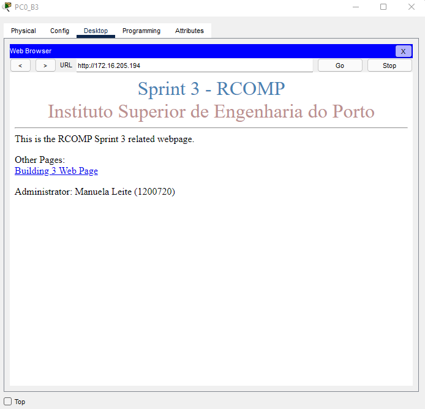
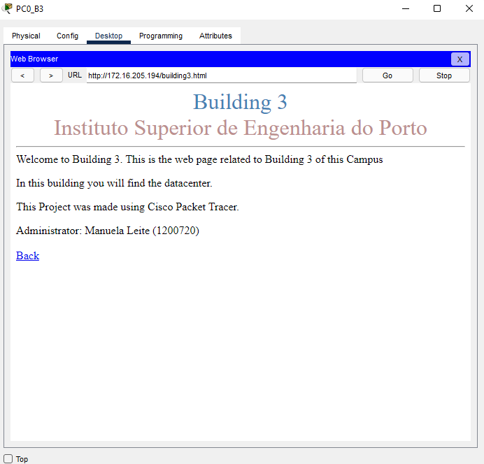
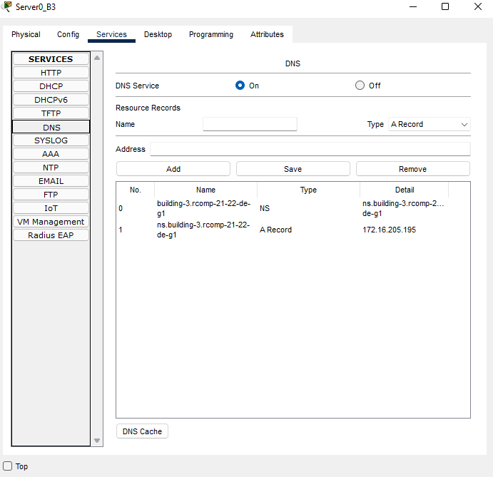

RCOMP 2021-2022 Project - Sprint 3 - Member 1200720 folder
===========================================

### Building 3

-------------------------------------------------------------------
#### OSPF (Open Shortest Path First)

- Static routes between buildings were eliminated, except for the default route connecting to the ISP 
(since without this route there would be no internet distribution across the campus).
  
  
- All areas of the different buildings are connected to area 0, corresponding to the backbone.
  
- R0_B3 router configuration
  - **Router(config)#** router ospf 3
  - **Router(config)#** network 172.16.205.0 0.0.0.255 area 3
  - **Router(config)#** network 172.16.200.0 0.0.0.127 area 0

-------------------------------------------------------------------
#### HTTP Server

- A server was placed in the DMZ VLAN to take over the HTTP service.
- Added a building identifier to an HTML page.4

  

-------------------------------------------------------------------

#### DHCPv4 Service

- The router in each building must be configured to provide a DHCPv4 service to all local networks excluding 
  the DMZ networks and the backbone.

* Floor 0:
    - **Router(config)#** ip dhcp pool b3groundfloor
    - **Router(dhcp-config)#** network 172.16.205.128 255.255.255.192
    - **Router(dhcp-config)#** default-router 172.16.205.129
    - **Router(dhcp-config)#** dns-server 172.16.205.195
    - **Router(config)#** domain-name rcomp-21-22-de-g1

* Floor 1:
    - **Router(config)#** ip dhcp pool b3firstfloor
    - **Router(dhcp-config)#** network 172.16.205.64 255.255.255.192
    - **Router(dhcp-config)#** default-router 172.16.205.65
    - **Router(dhcp-config)#** dns-server 172.16.205.195
    - **Router(dhcp-config)#** domain-name rcomp-21-22-de-g1

* WiFi:
    - **Router(config)#** ip dhcp pool b3wifi
    - **Router(dhcp-config)#** network 172.16.205.0 255.255.255.192
    - **Router(dhcp-config)#** default-router 172.16.205.1
    - **Router(dhcp-config)#** dns-server 172.16.205.195
    - **Router(dhcp-config)#** domain-name rcomp-21-22-de-g1
    
* VoIP:
    - **Router(config)#** ip dhcp pool b3voip
    - **Router(dhcp-config)#** network 172.16.205.224 255.255.255.224
    - **Router(dhcp-config)#** default-router 172.16.205.225
    - **Router(dhcp-config)#** option 150 ip 172.16.205.225
    - **Router(dhcp-config)#** dns-server 172.16.205.195
    - **Router(dhcp-config)#** domain-name rcomp-21-22-de-g1
    

* Gateway addresses have been deleted from the pool:
  
    - **Router(config)#** ip dhcp excluded-address 172.16.205.129
    - **Router(config)#** ip dhcp excluded-address 172.16.205.65
    - **Router(config)#** ip dhcp excluded-address 172.16.205.1
    - **Router(config)#** ip dhcp excluded-address 172.16.205.225

-------------------------------------------------------------------

#### VoIP Service

- On the ports of the switches connected to the phones, the respective voice vlan was 
  activated, and the access vlan deactivated.
  
  
- Automatic phone registration and directory number assignment
  - **Router(config)#** telephony-service
  - **Router(config-telephony)#** auto-reg-ephone
  - **Router(config-telephony)#** ip source-address 172.16.205.225 port 2000
  - **Router(config-telephony)#** max-ephones 40
  - **Router(config-telephony)#** max-dn 40
  - **Router(config-telephony)#** auto assign 11 to 12
  - **Router(config)#** ephone-dn 11
  - **Router(config-ephone-dn)#** number 3000
  - **Router(config)#** ephone-dn 12
  - **Router(config-ephone-dn)#** number 3001
  
  
- Calls forwarding

  - dial-peer voice 2 voip
  - destination-pattern 2…
  - session target ipv4:172.16.200.2

  - dial-peer voice 1 voip
  - destination-pattern 1…
  - session target ipv4:172.16.200.1

  - dial-peer voice 4 voip
  - destination-pattern 4…
  - session target ipv4:172.16.200.4

-------------------------------------------------------------------

#### DNS

The DNS table is shown below.

-------------------------------------------------------------------

#### NAT

- Static NAT was used to redirect traffic, and the commands below were 3used for this purpose:
  
  - **Router(config)#** ip nat inside source static tcp 172.16.205.194 80 172.16.200.1 80
  - **Router(config)#** ip nat inside source static tcp 172.16.205.194 443 172.16.200.1 443
  - **Router(config)#** ip nat inside source static tcp 172.16.205.195 53 172.16.200.1 53
  - **Router(config)#** ip nat inside source static udp 172.16.205.195 53 172.16.200.1 53

- Finally, each VLAN was placed inside the NAT created, with the exception of the backbone, through the commands:
  - ip nat inside
  - ip nat outside
