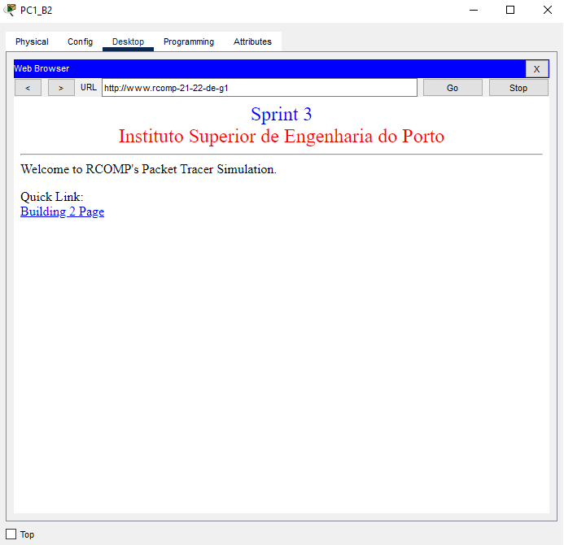
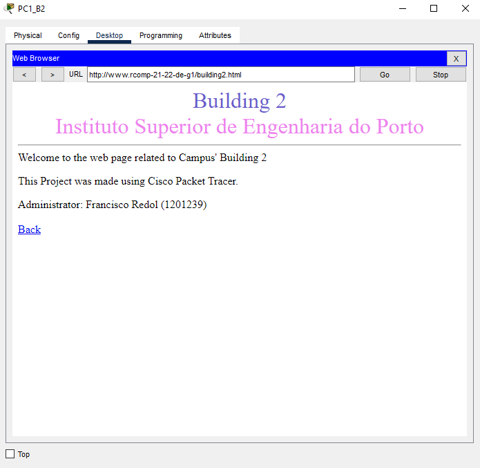
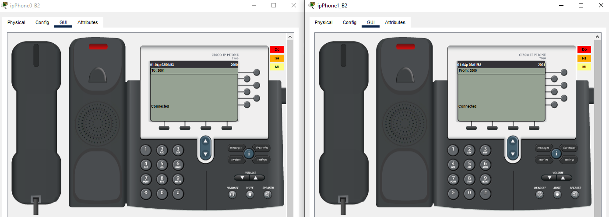
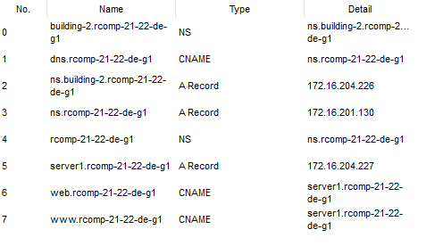

RCOMP 2021-2022 Project - Sprint 3 - Member 1201239 folder
===========================================

### Building 2

-------------------------------------------------------------------
#### OSPF (Open Shortest Path First)

Static routes between buildings were eliminated, except for the default route connecting to the ISP
  (since without this route there would be no internet distribution across the campus).

- R1_B2 router configuration
    - **Router(config)#** router ospf 5
    - **Router(config)#** network 172.16.200.0 0.0.0.127 area 0
    - **Router(config)#** network 172.16.204.0 0.0.0.255 area 2

-------------------------------------------------------------------
#### HTTP Server

- According to the Sprint description, it was needed to place another server on the DMZ VLAN to take over the HTTP service.

-------------------------------------------------------------------
#### DHCPv4 Service

- The router in each building must be configured to provide a DHCPv4 service to all local networks excluding

* Floor 0:
  - **Router(config)#** ip dhcp pool b2groundfloor
  - **Router(dhcp-config)#** network 172.16.204.192 255.255.255.224
  - **Router(dhcp-config)#** default-router 172.16.204.193
  - **Router(dhcp-config)#** dns-server 172.16.204.227
  - **Router(config)#** domain-name rcomp-21-22-de-g1

* Floor 1:
  - **Router(config)#** ip dhcp pool b2floorone
  - **Router(dhcp-config)#** network 172.16.204.128 255.255.255.192
  - **Router(dhcp-config)#** default-router 172.16.204.129
  - **Router(dhcp-config)#** dns-server 172.16.204.227
  - **Router(dhcp-config)#** domain-name rcomp-21-22-de-g1

* WiFi:
  - **Router(config)#** ip dhcp pool b2wifi
  - **Router(dhcp-config)#** network 172.16.204.0 255.255.255.128
  - **Router(dhcp-config)#** default-router 172.16.204.1
  - **Router(dhcp-config)#** dns-server 172.16.204.227
  - **Router(config)#** domain-name rcomp-21-22-de-g1

* VoIP:
  - **Router(config)#** ip dhcp pool b2voip
  - **Router(dhcp-config)#** network 172.16.204.240 255.255.255.240
  - **Router(dhcp-config)#** default-router 172.16.204.241
  - **Router(dhcp-config)#** option 150 ip 172.16.204.241
  - **Router(dhcp-config)#** dns-server 172.16.204.227
  - **Router(dhcp-config)#** domain-name rcomp-21-22-de-g1

* DHCP Excluded Addresses:

  - **Router(dhcp-config)#** ip dhcp excluded-address 172.16.204.193
  - **Router(dhcp-config)#** ip dhcp excluded-address 172.16.204.129
  - **Router(dhcp-config)#** ip dhcp excluded-address 172.16.204.1
  - **Router(dhcp-config)#** ip dhcp excluded-address 172.16.204.241

-------------------------------------------------------------------

#### VoIP Service errado tem de ser trocado

- On the ports of the switches connected to the phones, the respective voice vlan was
  activated, and the access vlan deactivated.

- Automatic phone registration and directory number assignment
  - **Router(config)#** telephony-service
  - **Router(config-telephony)#** auto-reg-ephone
  - **Router(config-telephony)#** ip source-address 172.16.204.241 port 2000
  - **Router(config-telephony)#** max-ephones 40
  - **Router(config-telephony)#** max-dn 40
  - **Router(config-telephony)#** auto assign 11 to 12
  - **Router(config)#** ephone-dn 11
  - **Router(config-ephone-dn)#** number 2000
  - **Router(config)#** ephone-dn 12
  - **Router(config-ephone-dn)#** number 2001

- Calls forwarding

  - dial-peer voice 1 voip
  - destination-pattern 1…
  - session target ipv4:172.16.200.1

  - dial-peer voice 3 voip
  - destination-pattern 3…
  - session target ipv4:172.16.200.3
  
  - dial-peer voice 4 voip
  - destination-pattern 4…
  - session target ipv4:172.16.200.4

- The image below shows both building phones connected

-------------------------------------------------------------------

#### DNS

The DNS table is shown below.

-------------------------------------------------------------------

#### NAT

- These are the commands used for the Static NAT to work:

  - **Router(config)#** ip nat inside source static tcp 172.16.204.227 80 172.16.200.2 80
  - **Router(config)#** ip nat inside source static tcp 172.16.204.227 443 172.16.200.2 443
  - **Router(config)#** ip nat inside source static tcp 172.16.204.226 53 172.16.200.2 53
  - **Router(config)#** ip nat inside source static udp 172.16.204.226 53 172.16.200.2 53

- Each VLAN was placed inside the NAT created, except the backbone, through the commands:
  - ip nat inside
  - ip nat outside

-------------------------------------------------------------------

#### ACL's

- access-list 100 permit ip 172.16.204.0 0.0.0.127 any
- access-list 101 permit ip 172.16.204.128 0.0.0.63 any
- access-list 102 permit ip 172.16.204.192 0.0.0.31 any
- access-list 103 permit ip 172.16.204.240 0.0.0.15 any
- access-list 105 deny ip 172.16.204.0 0.0.0.127 any
- access-list 105 deny ip 172.16.204.128 0.0.0.63 any
- access-list 105 deny ip 172.16.204.192 0.0.0.31 any
- access-list 105 deny ip 172.16.204.224 0.0.0.15 any
- access-list 105 deny ip 172.16.204.240 0.0.0.15 any
- access-list 100 permit icmp any any echo
- access-list 100 permit icmp any any echo-reply
- access-list 101 permit icmp any any echo
- access-list 101 permit icmp any any echo-reply
- access-list 102 permit icmp any any echo
- access-list 102 permit icmp any any echo-reply
- access-list 103 permit icmp any any echo
- access-list 103 permit icmp any any echo-reply
- access-list 105 permit icmp any any echo
- access-list 105 permit icmp any any echo-reply
- access-list 104 permit tcp any 172.16.204.227 eq 80
- access-list 104 permit tcp any 172.16.204.227 eq 443
- access-list 104 permit tcp any 172.16.204.226 eq 53
- access-list 104 permit udp any 172.16.204.226 eq 53
- access-list 104 permit ip 172.16.204.224 0.0.0.15 any
- access-list 100 permit ip any host 255.255.255.255
- access-list 101 permit ip any host 255.255.255.255
- access-list 102 permit ip any host 255.255.255.255
- access-list 103 permit ip any host 255.255.255.255
- access-list 104 permit ip any host 255.255.255.255
- access-list 105 permit ip any host 255.255.255.255
- access-list 100 permit udp any 172.16.204.1 eq tftp
- access-list 101 permit udp any 172.16.204.129 eq tftp
- access-list 102 permit udp any 172.16.204.193 eq tftp
- access-list 103 permit udp any 172.16.204.225 eq tftp
- access-list 104 permit udp any 172.16.220.241 eq tftp
- access-list 105 permit udp any 172.16.200.2 eq tftp
- access-list 100 permit tcp any 172.16.204.1 eq 2000
- access-list 101 permit tcp any 172.16.204.129 eq 2000
- access-list 102 permit tcp any 172.16.204.193 eq 2000
- access-list 103 permit tcp any 172.16.204.225 eq 2000
- access-list 104 permit tcp any 172.16.204.241 eq 2000
- access-list 105 permit tcp any 172.16.200.2 eq 2000
- access-list 105 permit tcp any 172.16.200.2 eq 1720
- access-list 100 permit ospf any any
- access-list 101 permit ospf any any
- access-list 102 permit ospf any any
- access-list 103 permit ospf any any
- access-list 104 permit ospf any any
- access-list 105 permit ospf any any
- access-list 100 deny ip any host 172.16.200.2
- access-list 101 deny ip any host 172.16.200.2
- access-list 102 deny ip any host 172.16.200.2
- access-list 103 deny ip any host 172.16.200.2
- access-list 104 deny ip any host 172.16.200.2
- access-list 105 deny ip any host 172.16.200.2
- access-list 100 permit ip any any
- access-list 101 permit ip any any
- access-list 102 permit ip any any
- access-list 103 permit ip any any
- access-list 104 permit ip any any
- access-list 105 permit ip any any