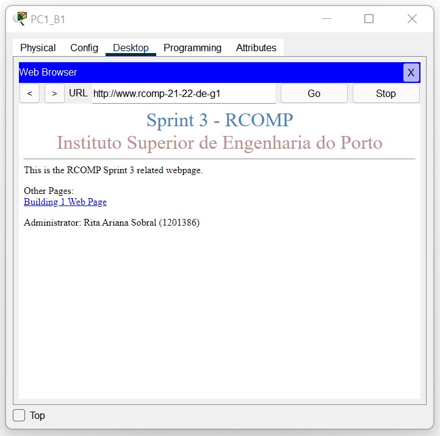
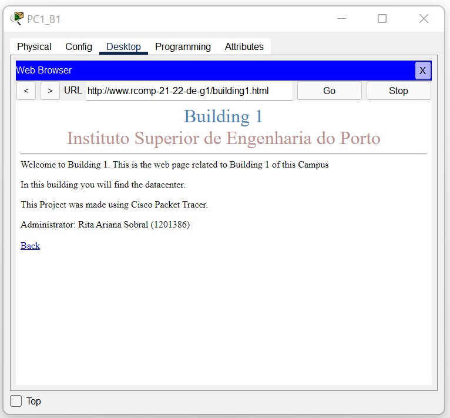
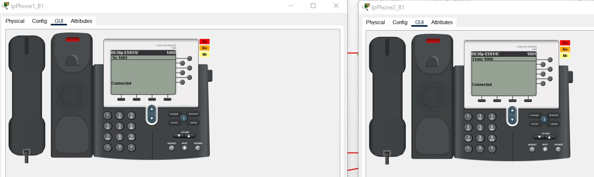
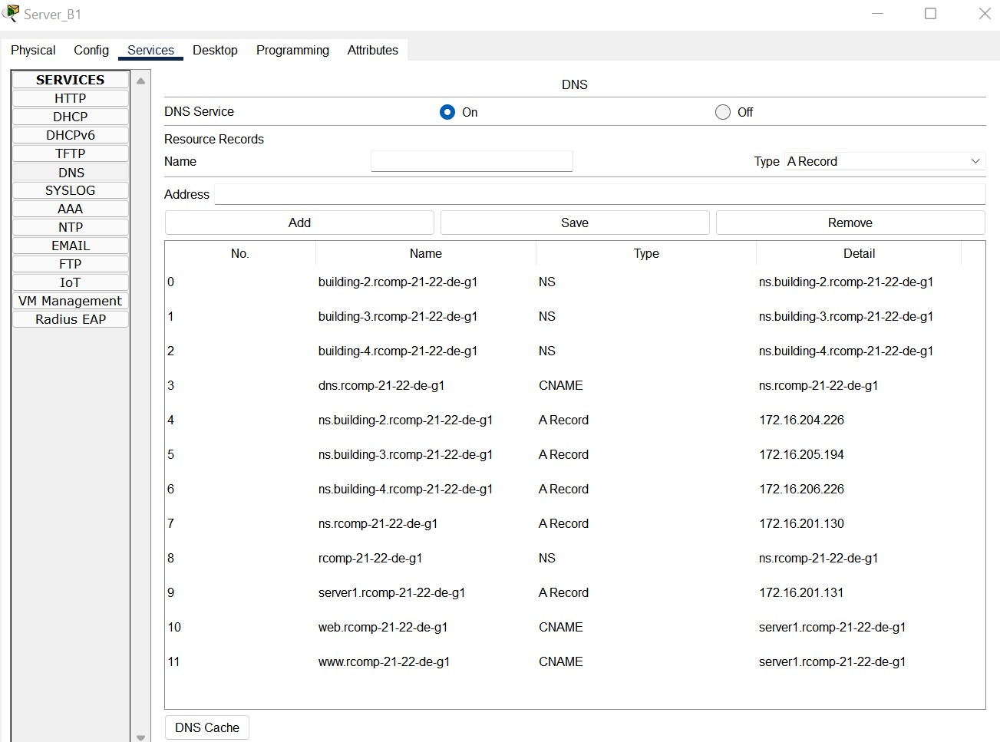

RCOMP 2021-2022 Project - Sprint 3 - Member 1201386 folder
===========================================

### Building 1

-------------------------------------------------------------------
#### OSPF (Open Shortest Path First)

- Static routes between buildings were eliminated, except for the default route connecting to the ISP 
(since without this route there would be no internet distribution across the campus).
  
  
- All areas of the different buildings are connected to area 0, corresponding to the backbone.
  
- R1_B1 router configuration
  - **Router(config)#** router ospf 1
  - **Router(config)#** network 172.16.200.0 0.0.0.127 area 0
  - **Router(config)#** network 172.16.200.128 0.0.0.127 area 1
  - **Router(config)#** network 172.16.201.0 0.0.0.255 area 1
  - **Router(config)#** network 172.16.202.0 0.0.0.127 area 1

- R0_B1 router configuration
  - **Router(config)#** router ospf 5
  - **Router(config)#** network 172.16.200.0 0.0.0.127 area 0
  
- Default route definition
  - **Router(config)#** ip route 0.0.0.0 0.0.0.0 15.203.47.93
  - **Router(config)#** router ospf 5
  - **Router(config-router)#** default-information originate

  

-------------------------------------------------------------------
#### HTTP Server

- A server was placed in the DMZ VLAN to take over the HTTP service.
- Added a building identifier to an HTML page.

  
 

-------------------------------------------------------------------

#### DHCPv4 Service

- The router in each building must be configured to provide a DHCPv4 service to all local networks excluding 
  the DMZ networks and the backbone.

* Floor 0:
    - **Router(config)#** ip dhcp pool b1groundfloor
    - **Router(dhcp-config)#** network 172.16.202.0 255.255.255.192
    - **Router(dhcp-config)#** default-router 172.16.202.1
    - **Router(dhcp-config)#** dns-server 172.16.201.130
    - **Router(config)#** domain-name rcomp-21-22-de-g1

* Floor 1:
    - **Router(config)#** ip dhcp pool b1floorone
    - **Router(dhcp-config)#** network 172.16.200.128 255.255.255.128
    - **Router(dhcp-config)#** default-router 172.16.200.129
    - **Router(dhcp-config)#** dns-server 172.16.201.130
    - **Router(dhcp-config)#** domain-name rcomp-21-22-de-g1

* WiFi:
    - **Router(config)#** ip dhcp pool b1wifi
    - **Router(dhcp-config)#** network 172.16.201.0 255.255.255.128
    - **Router(dhcp-config)#** default-router 172.16.201.1
    - **Router(dhcp-config)#** dns-server 172.16.201.130
    - **Router(dhcp-config)#** domain-name rcomp-21-22-de-g1
    
* VoIP:
    - **Router(config)#** ip dhcp pool b1voip
    - **Router(dhcp-config)#** network 172.16.202.64 255.255.255.192
    - **Router(dhcp-config)#** default-router 172.16.202.65
    - **Router(dhcp-config)#** option 150 ip 172.16.202.65
    - **Router(dhcp-config)#** dns-server 172.16.201.130
    - **Router(dhcp-config)#** domain-name rcomp-21-22-de-g1
    

* Gateway addresses have been deleted from the pool:
  
    - **Router(config)#** ip dhcp excluded-address 172.16.202.1
    - **Router(config)#** ip dhcp excluded-address 172.16.200.129
    - **Router(config)#** ip dhcp excluded-address 172.16.201.1
    - **Router(config)#** ip dhcp excluded-address 172.16.202.65

-------------------------------------------------------------------

#### VoIP Service

- On the ports of the switches connected to the phones, the respective voice vlan was 
  activated, and the access vlan deactivated.
  
  
- Automatic phone registration and directory number assignment
  - **Router(config)#** telephony-service
  - **Router(config-telephony)#** auto-reg-ephone
  - **Router(config-telephony)#** ip source-address 172.16.202.65 port 2000
  - **Router(config-telephony)#** max-ephones 40
  - **Router(config-telephony)#** max-dn 40
  - **Router(config-telephony)#** auto assign 11 to 12
  - **Router(config)#** ephone-dn 11
  - **Router(config-ephone-dn)#** number 1000
  - **Router(config)#** ephone-dn 12
  - **Router(config-ephone-dn)#** number 1001
  
  
- Calls forwarding

  - dial-peer voice 2 voip
  - destination-pattern 2…
  - session target ipv4:172.16.200.2

  - dial-peer voice 3 voip
  - destination-pattern 3…
  - session target ipv4:172.16.200.3

  - dial-peer voice 4 voip
  - destination-pattern 4…
  - session target ipv4:172.16.200.4
  
  
- The image below shows mobile 1000 communicating with telephone 1001.

-------------------------------------------------------------------

#### DNS

The DNS table is shown below.

-------------------------------------------------------------------

#### NAT

- Static NAT was used to redirect traffic, and the commands below were used for this purpose:
  
  - **Router(config)#** ip nat inside source static tcp 172.16.201.131 80 172.16.200.1 80
  - **Router(config)#** ip nat inside source static tcp 172.16.201.131 443 172.16.200.1 443
  - **Router(config)#** ip nat inside source static tcp 172.16.201.130 53 172.16.200.1 53
  - **Router(config)#** ip nat inside source static udp 172.16.201.130 53 172.16.200.1 53

- Finally, each VLAN was placed inside the NAT created, with the exception of the backbone, through the commands:
  - ip nat inside
  - ip nat outside
-------------------------------------------------------------------

#### ACLS

- no access-list 5
- no access-list 100
- no access-list 101
- no access-list 102 
- no access-list 103
- no access-list 104
- no access-list 105

- access-list 5 permit 172.16.200.0 0.0.0.127

- access-list 100 permit ip 172.16.202.0 0.0.0.63 any
- access-list 100 permit icmp any any echo
- access-list 100 permit icmp any any echo-reply
- access-list 100 permit ip any host 255.255.255.255
- access-list 100 permit udp any host 172.16.202.1 eq tftp
- access-list 100 permit tcp any host 172.16.202.1 eq 2000
- access-list 100 permit ospf any any
- access-list 100 deny ip any host 172.16.202.1
- access-list 100 permit ip any any

- access-list 101 permit ip 172.16.200.128 0.0.0.127 any
- access-list 101 permit icmp any any echo-reply
- access-list 101 permit icmp any any echo 
- access-list 101 permit ip any host 255.255.255.255
- access-list 101 permit udp any host 172.16.200.129 eq tftp
- access-list 101 permit tcp any host 172.16.200.129 eq 2000 
- access-list 101 permit ospf any any
- access-list 101 deny ip any host 172.16.200.129
- access-list 101 permit ip any any

- access-list 102 permit ip 172.16.201.0 0.0.0.127 any
- access-list 102 permit icmp any any echo
- access-list 102 permit icmp any any echo-reply
- access-list 102 permit ip any host 255.255.255.255
- access-list 102 permit udp any host 172.16.201.1 eq tftp
- access-list 102 permit tcp any host 172.16.201.1 eq 2000
- access-list 102 permit ospf any any
- access-list 102 deny ip any host 172.16.201.1
- access-list 102 permit ip any any

- access-list 103 permit ip 172.16.202.64 0.0.0.63 any
- access-list 103 permit icmp any any echo
- access-list 103 permit icmp any any echo-reply
- access-list 103 permit ip any host 255.255.255.255
- access-list 103 permit udp any host 172.16.202.65 eq tftp
- access-list 103 permit tcp any host 172.16.202.65 eq 2000
- access-list 103 permit ospf any any
- access-list 103 deny ip any host 172.16.202.65
- access-list 103 permit ip any any

- access-list 104 permit udp any host 172.16.201.130 eq domain
- access-list 104 permit tcp any host 172.16.201.131 eq www
- access-list 104 permit ip 172.16.201.128 0.0.0.127 any
- access-list 104 permit ip any host 255.255.255.255
- access-list 104 permit udp any host 172.16.201.129 eq tftp
- access-list 104 permit tcp any host 172.16.201.129 eq 2000
- access-list 104 permit ospf any any
- access-list 104 deny ip any host 172.16.201.129
- access-list 104 permit ip any any
- access-list 104 permit ospf any host 172.16.200.1

- access-list 105 deny ip 172.16.201.128 0.0.0.127 any
- access-list 105 deny ip 172.16.201.0 0.0.0.127 any
- access-list 105 deny ip 172.16.200.128 0.0.0.127 any
- access-list 105 deny ip 172.16.202.0 0.0.0.63 any
- access-list 105 deny ip 172.16.202.64 0.0.0.63 any
- access-list 105 permit icmp any any echo
- access-list 105 permit icmp any any echo-reply
- access-list 105 permit ospf any any
- access-list 105 permit tcp any host 172.16.200.1 eq 2000
- access-list 105 permit tcp any host 172.16.200.1 eq 1720
- access-list 105 permit tcp any eq 1720 host 172.16.200.1
- access-list 105 permit udp any host 172.16.200.1 eq domain
- access-list 105 permit tcp any host 172.16.200.1 eq www
- access-list 105 deny ip any host 172.16.200.1
- access-list 105 permit ip any any

-------------------------------------------------------------------

